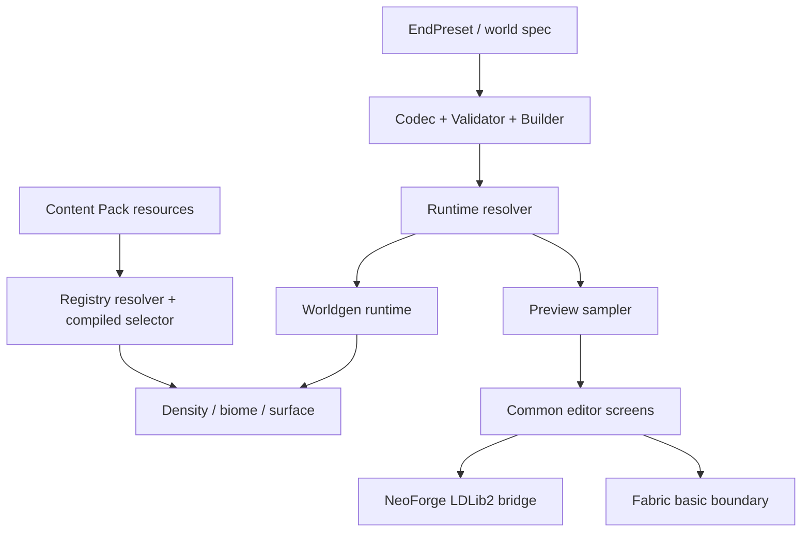
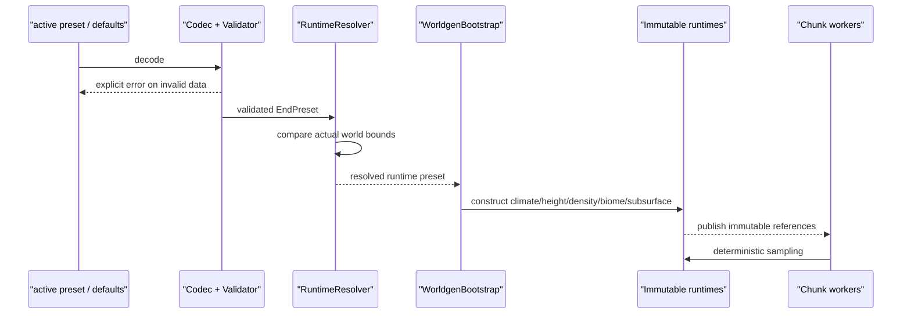
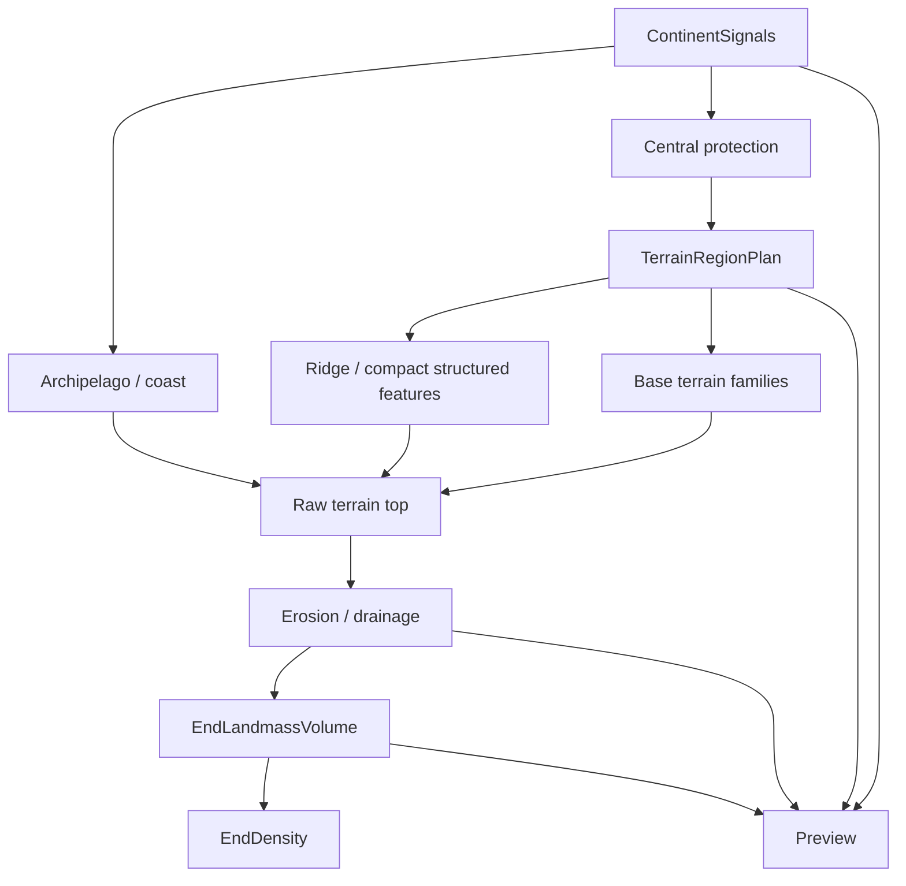

# EndTerraForged 架构说明

> 文档状态：当前有效。
> 最近更新：2026-07-15。
> 本文定义模块边界、数据流、线程安全和扩展点；产品阶段以 [`../GOAL.md`](../GOAL.md) 为准。

## 1. 架构目标

EndTerraForged 的核心难点不是“生成一张好看的噪声图”，而是让以下链路长期保持一致：

- 持久化 preset 能安全升级和校验。
- runtime worldgen 使用确定性、线程安全且性能可控的数学路径。
- preview 能观察同一参数对正式生成的影响。
- NeoForge UI 能编辑配置，但不污染跨平台核心。
- Fabric、C2ME 和其他末地模组不会因平台依赖或共享状态被破坏。

架构采用一个跨平台核心、两个薄平台适配层，以及数据驱动兼容包。

## 2. 模块边界

### 2.1 `common`

`common` 是唯一跨平台业务核心，负责：

- `EndPreset`、各配置 record、Codec、Validator 和 Builder。
- active preset、named preset library 和纯文件存储策略。
- world bounds 对齐、worldgen bootstrap、地形、气候、大陆、群系布局、侵蚀、地下和 density 逻辑。
- preview sampler、palette、剖面和布局纯策略。
- 可跨平台使用的 Minecraft GUI screen/widget 基础。
- 平台无关的入口可见性、保存完成和错误状态策略。
- 单元测试、架构边界测试和资源校验。

禁止：

- import NeoForge、Fabric、LDLib2 包。
- 直接监听平台事件。
- 直接依赖平台文件选择器、toast 或平台 screen adapter。
- 把 registry holder、客户端视角状态或 preview-only mask 写入 preset。

`CommonSourceBoundaryTest` 是自动门禁。反射探测 LDLib2 bridge 的 allowlist 必须保持最小，并证明 common 没有编译或运行时平台依赖。

创建世界入口是一个跨加载器的 vanilla 客户端接入点，因此 `MixinCreateWorldScreen` 位于 common mixin 的 `client` 数组；它只负责把独立 ETF 按钮接到 `EndPresetEditorScreen`。按钮位置由可单测的 `CreateWorldPresetEditorButtonPlan` 决定。ETF 不得向 `PresetEditor.EDITORS` 的 `WorldPresets.NORMAL` 注册编辑器，因为该全局一对一槽位会覆盖 ReTerraForged 等主世界生成模组的 `Customize` 入口。平台专用 LDLib2 组件和已有世界入口仍由 NeoForge 适配层负责。

### 2.2 `neoforge`

NeoForge 是官方体验适配层，负责：

- 客户端事件和 screen 注入。
- LDLib2 action bar 与高级组件桥接。
- 从集成服务器获取可靠 `worldDir`。
- toast、暂停菜单和已有世界编辑入口。
- NeoForge runtime 依赖与 mixin 配置。
- 真实客户端冒烟和官方兼容适配器。

平台层不重新实现 preset 校验、保存策略、按钮布局或 worldgen 数学。能下沉为纯策略并单测的逻辑应留在 common。

NeoForge 源码不得声明 common 已拥有的 Java package，避免 Architectury 开发运行时 JPMS split-package。

### 2.3 `fabric`

Fabric 负责：

- 平台入口、mixin、access widener 和基础 worldgen 接线。
- 验证 common 没有泄漏 NeoForge/LDLib2 API。
- 为社区移植高级 UI 留出边界。

Fabric 不承担官方完整高级编辑器，也不引入第二套 UI 组件库。触及 common 或平台边界时必须编译 Fabric。

### 2.4 数据包与兼容包

数据包负责：

- dimension/noise 世界规格。
- Content Pack、Content Profile、群系 tag、surface/feature/structure 数据。
- 官方或第三方模组兼容映射。

数据包不能改变 ETF Java 热路径的线程安全契约，也不能在加载失败时让世界进入无群系或半配置状态。

## 3. 配置到 worldgen 的数据流

关键规则：

1. Codec 处理结构和兼容默认值，Validator 处理跨字段不变量。
2. Builder 是编辑状态的唯一构造入口，不能在 UI 中手工复制 record 全字段。
3. `EndPresetRuntimeResolver` 是 preset world bounds 与 Minecraft 实际 bounds 的唯一对齐点。
4. bootstrap 要么发布完整 runtime，要么明确降级并清理已发布状态，不能泄漏半初始化对象。
5. chunk worker 只读取 immutable runtime；不在采样过程中修改全局配置。

## 4. 世界规格与 preset 的边界

世界规格和地形 preset 是两个相关但不同的概念：

- 世界规格决定 `dimension_type` / `noise_settings` 的 `min_y`、`height` 和垂直 cell 数，只能在创建世界时可靠选择。
- 地形 preset 决定大陆、地形、气候、群系布局、侵蚀和地下参数。
- runtime preset 必须使用实际加载世界的 bounds。
- 已有世界编辑只允许修改在既有 bounds 内有效的参数；不能扩容维度。

Standard 默认包络为 `-256..255`。1024/2048/4064 只有在创建世界规格链完整接入后才能成为可选项。

## 5. 地表生成分层

当前 `EndTerrainComposer` 使用一个低频 selector 按权重区间选择通用 terrain layer。该路径
保留为旧 preset 和低成本回归基线，但不再是高质量地表的目标架构。正式重构必须保持以下
职责链：

1. **Central protection**：`EndCentralRegionPolicy` 以半径 `1536` 把中央区交给 vanilla End `final_density`，并在 `1536..2048` 交接到 ETF 外部大陆，不让 ETF terrain、浮岛、洞穴或 Content Pack 改写主岛、龙战与早期外岛缓冲。由于正式 router 使用 `max(main, floating)`，浮岛 overlay 在保护区必须返回 vanilla density 下界，不能简单返回零。常规 provider 路径与 `ChunkMap` direct settings 路径均已实现；后者在调用点一次性捕获 `ServerLevel` 动态注册表的 getter-provider。没有可信 provider、fallback 构造失败或 per-chunk binding 失败会带诊断地拒绝 ETF End 创建/区块生成，不能静默用 unresolved placeholder 产出空气。真实客户端和整合包回归仍是发布前门禁。
2. **Macro topology**：只在中央保护区外选择大陆中心、尺度、虚空海峡和群岛；`1536..2048` 是纯函数定义的启动带，不能以固定半径切出墙体。新 preset 的 `ORGANIC` 海岸在单次 cell 搜索中同时使用最近/次近距离，并叠加独立 coast noise，形成海湾、岬角和碎裂边缘；旧 JSON 缺少 coast 字段时使用 `RADIAL_LEGACY`，以保证存档不被静默重塑。
3. **Continent signals**：统一输出 edge、landness、inlandness、continent id 和 center；用于海岸、volume、terrain region 与调试。
4. **Terrain region plan**：用不可变、零热路径分配的 AREA ownership 布局输出 region id、center、edge、ownership family、边界 family、blend 与 orientation。全部正权重 AREA family 参加同一个无空洞分区；AREA `weight` 表示近似面积占比，独立 region scale 只改变重复区域尺寸，搜索必须有界并可早停。
5. **Base terrain families**：平原、丘陵、高原和 AREA 山地等固定核心 family 只输出 height、roughness、erosion resistance 和 terrain tags。同一 ownership region 可按 seed/region/family 选择稳定 morphology variant；family 不访问 registry、Content Pack 或 Minecraft 平台 API。
6. **Shape-aware morphology**：RIDGE 使用独立、确定性、有界 anchor overlay，不参与宏观 ownership。每点最多组合三个候选，relief 取最大值，最强 physical influence 决定可见 identity 和信号元数据；footprint 外严格保留真实 AREA owner 与信号。COMPACT 火山在当前阶段冻结，后续另行定义 ownership 与末地体积语义。
7. **Archipelago / coast**：附属群岛使用大陆 edge 与同一 volume，不生成海床，也不复用高空浮岛系统；不按大陆中心距离额外抬升整体地形。
8. **Erosion / drainage**：先对稳定 raw top 做 analytical erosion；高成本 hydraulic tile 只能区域对齐、带 border、worker-owned 且有界缓存。侵蚀不重新选择大陆或 terrain family。
9. **Vertical volume**：`EndLandmassVolume` 把最终 top surface 与大陆 underside 组合为真实浮空体积。`FLOATING_SHELF` 先按 landness 平滑插值得到边缘/主体厚度，再乘同一 `edgeFade`，使厚度在 void 边界收敛到零而不是形成实体直壁；新默认使用有限 shelf，只有显式/迁移的 `LEGACY_COLUMN` 才继续按 SeaMode 填充整列。underside 是 column cache 的一部分，不能在每个 density Y 采样中重复计算。
10. **Subsurface carve**：在实体体积中切削深渊和洞穴。
11. **Content selection/surface**：消费地形、气候、深度和 Content Pack，不反向修改 density，也不越过中央保护边界。

`TerrainRegionPlan`、family 输出和最终 top 必须在同一 X/Z 列缓存刷新中计算一次并复用给整列。
preview 通过相同 primitive 分别输出 AREA ownership、visible family、RIDGE physical influence、
region edge、feature 和 erosion 诊断，不维护第二套数学。

`FLOATING_SHELF` 等大陆形态必须作为 vertical volume 策略，而不是在 UI 或 biome source 中拼凑。二维 `VOLUME` 预览和 `LandmassSlicePreviewSampler` 使用该对象；X/Z 剖面通过无 carve `EndDensity` 显示大陆本体，洞穴 editor 单独显示 carved-space 诊断，二者不能混淆。

`OUTER_CONTINENTS` 当前采用独立的 `outer_continent_scale`，不修改旧 `continent_scale` 的破碎大陆语义。`EndPreset` 通过 `format_version` 区分默认迁移：版本 2 写出外部大陆与有限 shelf；缺失版本按历史群岛加载，缺失 `volume_mode` 的 continent 按历史无限列加载。格式版本是持久化元数据，不是编辑器可调地形参数。

## 6. 地下系统边界

地下主线由三个层次组成：

### 6.1 Region graph

- 以大于区块的稳定 region/cell 构造节点和连接。
- 节点类型承载洞厅、裂隙、河流和层级语义。
- 节点只由 seed、配置和 region 坐标决定，与区块访问顺序无关。
- 查询相邻 region 时结果必须对称，避免区块边界断裂。

### 6.2 SDF/体积场

- ellipsoid/metaball 形成洞厅。
- spline/capsule 形成长通道和河道。
- fracture plane/prism 形成裂隙和深渊。
- CSG union/subtract/intersection 组合 carve 与保留体积。
- 低频噪声只扰动边界，不替代大尺度图结构。

### 6.3 方块与生态

- density carve 先确定空气空间。
- ETF End 的非实体密度单元使用空气 fluid picker；Minecraft 全局 picker 的 `Y < -54` 岩浆规则不得填充大陆下方或虚空海峡。
- 地下河和熔岩在正式液体阶段写入方块/流体规则。
- 桥梁和石柱使用保留体积或受约束的后处理。
- biome、feature、structure hook 在几何稳定后接入。

`CAVE_WATER`、`CAVE_LAVA` 等 preview mask 只能表示候选区域。正式生成必须有独立 runtime 消费者、测试和状态说明。

## 7. Preview 架构

preview 的目标是可观察正式参数，不是制作一套独立地形算法。

- sampler 复用 runtime 对象或共享纯数学 primitive。
- `OUTER_CONTINENTS` 的广域预览按 `outer_continent_scale` 扩大采样跨度，并对代表大陆中心进行确定性局部细化；不能把宏观大陆硬裁进固定的小窗口后误导用户。
- 预览模式只选择输出通道，不修改 preset。
- 相机、缩放、剖面轴、剖面偏移和调试叠加属于 editor state。
- 编辑器滑块产生 `EndPresetBuilder` 快照，校验成功后提交异步预览任务。
- 拖动时允许低清；停止交互后生成高清；新任务取消旧任务。
- preview worker 不读取可变 screen widget，也不调用服务端 worldgen 状态。
- 2D/剖面完成后再增加 3D mesh；低配设备始终可以关闭 3D。

## 8. Content Pack 架构

Content Pack 不拥有 terrain density，只消费一个稳定选择上下文：

- x/y/z 与稳定空间单元。
- macro zone、temperature、moisture 和其他稳定 scalar。
- 当地 top/underside/cave surface 的有符号深度。
- `TOP_SURFACE`、`UNDERSIDE`、`CAVE_FLOOR`、`CAVE_CEILING`、`VOID_EDGE`。
- terrain form、cave type 或公开稳定 terrain tags。
- seed、pack id、profile id 与 fallback 信息。

Content Profile 独立于 Minecraft biome holder：profile 可以引用 registered biome/tag，同时拥有独立 palette 与 feature。资源加载后先完成 schema、registry、fallback 和 dependency 解析，再发布 immutable selector。缺失资源按定义 fallback；严重格式错误阻止该 pack 启用并输出可定位诊断。

普通 pack 不解释脚本，也不控制 density。需要目标模组 API、Terra pack 或专用结构系统时使用独立 adapter。详细格式见 [`CONTENT_PACK_SPEC.md`](CONTENT_PACK_SPEC.md)，Terra/ReimagEND 边界见 [`TERRA_CONTENT_COMPATIBILITY_RESEARCH.md`](TERRA_CONTENT_COMPATIBILITY_RESEARCH.md)。

## 9. 线程安全与 C2ME

所有 worldgen 类必须说明其线程安全级别。默认设计：

- 配置 record：immutable，可跨线程共享。
- runtime：构造后 immutable，可跨线程共享。
- scratch、节点数组和列缓存：`ThreadLocal` 或 worker-owned，不跨线程共享。
- access holder：只发布完整 immutable 引用；生命周期在服务器停止和失败回滚时清理。
- 缓存：有界，key 包含必要的 seed/config/owner 信息。

禁止模式：

- 依赖区块访问顺序的随机数流。
- 采样时修改 static collection。
- 无界按坐标缓存。
- 多世界复用没有 owner 的 ThreadLocal 数据。
- 以同步大锁包裹每个 density sample。
- 预览和 worldgen 并发写同一个 mutable generator。

C2ME 验证不能只看“游戏没崩溃”；还要比较单线程参考与并行生成的固定坐标输出。

## 10. 故障与降级

- preset 文件结构损坏：明确拒绝打开，不用默认值覆盖原文件。
- runtime bootstrap 失败：记录 WARN/ERROR、回滚 access holder、走定义好的 vanilla/安全路径。
- 单次采样失败：必须限流日志，避免热路径刷屏；降级语义应有测试。
- Content Pack 缺失可选 biome/profile/feature：禁用对应内容并使用声明的 fallback，记录一次资源加载诊断。
- 强制接管冲突：说明冲突模组、资源或 mixin 点，不能静默覆盖。共享 `NoiseChunk.mapAll` 等扩展点优先通过 visitor/参数组合，禁止用 ETF `@Redirect` 排除另一个维度 generator 的 wrapper；ReTerraForged 主世界 + ETF 末地是该规则的首个真实回归组合。
- UI 保存失败：不发布半成功内存 preset，不关闭错误状态。

## 11. 测试边界

- config：Codec、Validator、Builder、旧 JSON。
- worldgen：默认回归、参数差异、确定性、边界连续性。
- preview：与 runtime primitive 对齐、模式隔离、取消和分辨率策略。
- architecture：common/platform 依赖、split package、资源 key。
- compatibility：固定模组/Content Pack 矩阵、许可边界和并行生成。
- client smoke：新世界、已有世界、暂停菜单、LDLib2、保存与重进。
- release：transform、remap、metadata、资源、语言和仓库卫生。

自动测试保护契约，真实客户端验证保护产品体验，两者不能互相替代。
