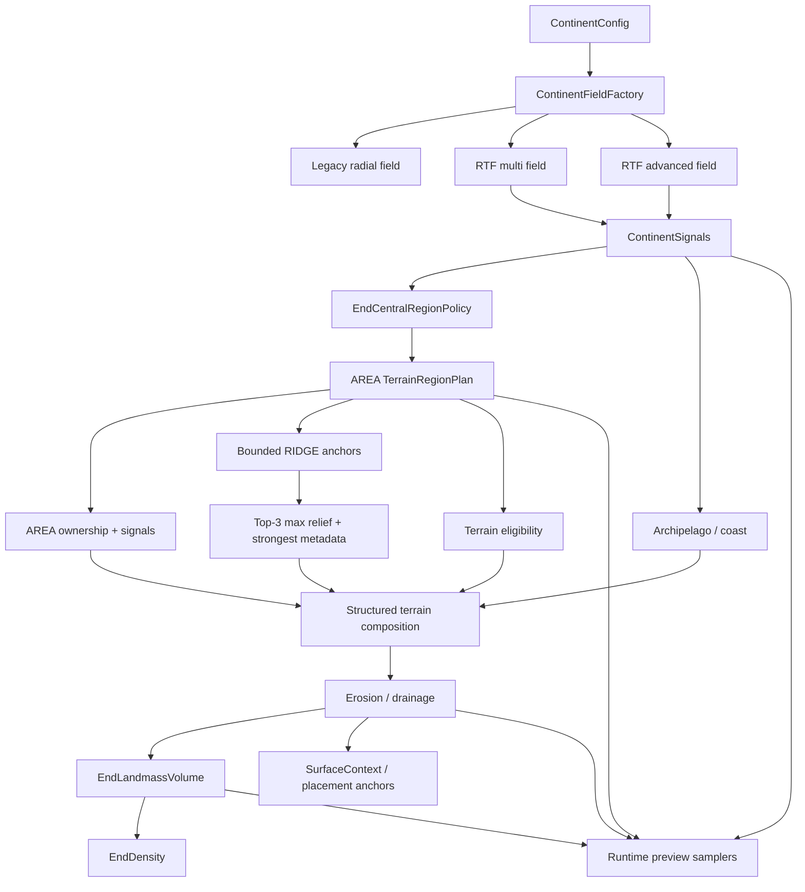

# RTF 核心复用与 ETF 高质量地表重构技术方案

> 文档状态：当前有效，属于阶段 B 的实现规格，不代表功能已经完成。
> 最近更新：2026-07-23。
> 适用范围：主岛外宏观大陆、地貌区域规划、地貌族、形状化山脉/火山、海岸、群岛、侵蚀、有限垂直体积、预览与性能验收。
> 不适用范围：RTF UI、RTF cave、主世界河流缓存、主世界 biome 选择、原版末地主岛与外围保护区。
>
> **2026-07-15 来源成熟度修正（优先于本文旧的火山候选描述）**：用户确认本地
> ReTerraForged 的火山仍未完成。RTF volcano、`COMPACT` 火山 shape 与 flow 不再是 ETF 的
> 直接移植来源，也不属于 `0.2.0` 首个高质量地表切片。ETF 工作树中的
> `EndTerrainVolcanoRuntime` 仅是封闭研究草稿，冻结在 runtime/测试范围内，不得进入
> `format_version=4`、玩家 preset 或 UI。后续火山必须先完成无 RTF volcano 代码依赖的独立
> 地质规格、固定 seed 视觉样本、有限体积契约和 Standard 性能预算，才可重新立项。

## 1. 结论

EndTerraForged 不应继续在当前径向大陆和单一 terrain selector 上叠加更多修补。当前
版本显得拙劣，不是因为 slider 数量不足，而是只完成了大陆轮廓、有限体积和几种通用
噪声层，尚未具备 RTF 真正决定视觉质量的区域级地貌编排。

下一阶段应直接复用 ReTerraForged 的 MIT 纯数学，并把它重新组装为适合末地的分层
地表管线：

```text
advanced continent
-> terrain region plan
-> terrain families
-> ridge/compact structured features
-> archipelago/coast
-> erosion/drainage
-> finite End landmass volume
```

最终路线是：

1. 直接移植 RTF R9.3.6 / R9.6 中稳定且版本间未变化的 Voronoi 大陆数学。
2. 以当前 RTF 开发分支的 terrain region 和 shape-aware placement 作为候选来源，但先按
   独立模块验证，不能因为它们存在于 RTF 工作树就直接设为 ETF 默认；火山不在候选范围。
3. 第一批完成 `RTF_ADVANCED`，第二批建立 ETF 原生 `TerrainRegionPlan`，第三批接入
   平原、丘陵、高原与有限山系等成熟地貌族。
4. 山脉使用有限 ridge；火山留待独立自研阶段。禁止继续让所有地貌在整张大陆上同时叠加。
5. `UpliftContinentGenerator` 的中心距离抬升不进入 ETF。它会把大陆中心距离变成整体高度包络，
   扭曲 AREA/RIDGE 地貌并增加每列距离、平滑和信号传播成本；大陆中心只保留为 ownership/诊断数据。
6. RTF 的 `ArchipelagoPopulator` 不整体搬入；只拆取群岛 mask、海岸分带和 relief
   组合方法。
7. hydraulic erosion 和 river geometry 只能改造成确定性、有界、区块顺序无关的
   末地后处理；不得搬入 `RiverCache`、water table 或每 density sample 的模拟。
8. ETF 继续负责中央原版保护、末地虚空、有限大陆体积、地下 carve、preview、
   preset 迁移和 C2ME 安全。
9. 新算法先以显式模式进入，不直接重解释已有 `format_version=3` 世界。
10. 只有固定 seed 视觉验收和 JFR 性能门禁同时通过后，才把新算法设为新世界默认。
11. RTF 的 `WorldFilters` 只复用“先形态、后可选侵蚀/平滑、再派生坡度/边缘、
    最后校正”的阶段语义；不把可变 `Cell[]` droplet 模拟塞进 density 热路径。
12. RTF 的 climate region、terrain biome filter 和 low redirect 只复用稳定单元、
    有界候选搜索与兼容性策略；ETF 使用资源键、编译期数组索引和只读信号，不使用
    列表下标身份、全局可变 `Map` 或主世界假水体语义。
13. RTF 的 surface/structure 消费模式应转化为 ETF `SurfaceContext` 与 placement anchor，
    使 Content Pack 消费 slope、curvature、sediment、terrain tags 和结构化地貌信号，
    但不得反向接管 density。
14. RTF 预览中的异步重算、旧帧保留和任务取消可作为调度参考；ETF 不复制其 UI，
    纹理上传仍只在渲染线程执行。
15. RTF 的线程预算只可参考给 preview 与离线 tile 后处理。ETF 不创建第二套正式
    worldgen executor 与 Minecraft/C2ME 争抢 CPU。

推荐默认候选不是单独的 `RTF_ADVANCED`，而是
`RTF_ADVANCED + REGION_PLANNED + 核心地貌族`。如果高级大陆在 Standard 完整区块生成
中的 p95 成本明显高于 `RTF_MULTI`，可保留 `RTF_MULTI` 作为低成本拓扑，但不能退回
“单一 selector + 通用 Perlin 层”的旧地貌编排。hydraulic erosion 和当前 RTF 开发分支中的
shape-aware 扩展在完成独立性能和末地语义验证前只能是实验能力；中心距离 uplift 已明确拒绝。

2026-07-18 对 RTF 最新 S4.3-S4.7 的审查覆盖了旧 S4.2 结论。RTF 当前使用
`AREA + COMPACT` 完整 ownership、独立 bounded `RIDGE` overlay；实机证据证明 RIDGE 若拥有
完整宏观区域而实体山脉只覆盖其中一部分，会造成平地身份、权重语义和视觉边界错位。
ETF 当前阶段冻结 COMPACT，因此首个生产契约进一步收窄为 AREA-only ownership + RIDGE
anchor overlay。完整阶段审查见
[`reviews/RTF_TERRAIN_REGION_ARCHITECTURE_REVIEW_2026-07-18.md`](reviews/RTF_TERRAIN_REGION_ARCHITECTURE_REVIEW_2026-07-18.md)。

### 1.1 RTF 能力复用分级

RTF 值得复用的内容不只是大陆轮廓。ETF 应按下面三类管理来源，避免“只抄一个算法”
和“整套框架原样搬入”这两个极端。

**A级：优先直接移植纯数学，并建立逐位 fixture**

- `AdvancedContinentGenerator` 的两阶段 Voronoi、中垂线距离、尺寸变化、中心校正和
  cliff/bay 海岸修正。
- 统一 terrain ownership 中的有界候选搜索、稳定 region id/center/edge、区域旋转和
  `weight / regionScale^2` 面积补偿。
- plains、steppe、hills、dales、plateau、mountains 等成熟地貌族的形态函数。
- `PerlinRidge`、`SimplexRidge`、terrace、steps、curve/spline、Worley edge 和 masked
  erosion 等纯噪声 primitive。
- ridge 的有限 envelope、端点衰减、旋转 footprint 与 footprint 外严格归零契约。
  `compact`/volcano 仅可作为未来自研时的几何验收参考，不能从当前 RTF 火山直接迁移。
- `RegionLerper`、`MountainChainBlender` 中连续通道混合、身份保持和 shaped influence
  淡出的数学规则。

**B级：保留设计语义，但必须改造成 ETF 架构**

- `UpliftContinentGenerator` 的中心距离 uplift 明确拒绝；大陆中心仅可作为 ownership/诊断元数据，
  不得消费为高度包络。
- `ArchipelagoPopulator` 拆成群岛 mask、海岸分带和 relief，不保留海洋、海床或
  `Cell` 写入。
- `WorldFilters` 只保留后处理阶段顺序；droplet erosion 改为有界、区域对齐的离线
  tile 实验，不能进入 density sample。
- `ClimateModule` 提取稳定 climate region、warp、macro variant 和温湿度场，输出
  immutable signal，不写 biome holder。
- `TerrainLowRedirect` 的“只改变下游意图、不改 ownership/terrain identity”原则，
  改造成 `EndTerrainEligibilityPolicy` 和 Content Profile fallback。
- surface rule 与 structure rule 的消费方式改成只读 `SurfaceContext` 和版本化 placement
  anchor；下游不得重新猜测地貌或反向修改 density。
- RTF 预览只借鉴 generation id、旧帧保留、过期任务取消和渲染线程上传；不复制 UI。
- RTF 性能配置与线程规划只用于推导 preview/tile worker 预算；正式 worldgen 继续由
  Minecraft/C2ME 调度。

**C级：明确禁止移植**

- `GeneratorContext`、池化可变 `Cell`、`Resource<Cell>` 和整对象 `copyFrom` 管线。
- water table、海洋深度、主世界河流/湖泊、`RiverCache`、fake water biome 和主世界
  biome registry 绑定。
- 列表下标作为持久化身份、运行时全局可变 `Map`、无界候选缓存和跨 worker mutable
  scratch。
- RTF 私有正式 worldgen executor、独占 `NoiseRouter.mapAll` 注入、RTF UI 和 RTF cave。

### 1.2 还应从 RTF 吸收的工程能力

除地形公式外，ETF 还需要补齐以下工程能力，否则即使外观接近 RTF，也仍然难以维护：

1. **稳定 seed 命名空间**：为 continent、region、family、variant、ridge、volcano、
   archipelago、erosion 和 climate 分配固定 salt。新增模块不得通过改变顺序让
   旧模块的 seed 漂移。
2. **公共信号快照**：把 continent、terrain、feature、erosion、climate 的最终只读信号
   汇总为 caller-owned primitive buffer。preview、surface、structure 和 Content Pack
   只消费该快照，不各自重算一套公式。
3. **诊断优先**：每个阶段提供固定坐标 dump、调试预览层和明确日志，使“没有大陆”
   “地貌没生效”“被 eligibility 压制”“进入 fallback”可以区分。
4. **有界工作预算**：所有邻域搜索、tile、preview 队列和缓存都必须有配置无关的硬上限
   或可证明上限；高世界不能靠扩大无界搜索获得质量。
5. **逐层 golden fixture**：先固定 primitive，再固定 region，再固定 family/feature，
   最后固定完整 top/volume。这样上游迁移不会把下游视觉变化伪装成随机回归。
6. **身份与连续值分离**：ownership/resource key 保持稳定，height、roughness、influence
   等连续信号可以混合；禁止因为边缘 alpha 变化而让持久化身份来回跳变。

## 2. 调研范围与版本依据

本轮只读审查以下来源，没有修改 RTF 仓库：

- `ReTerraForged` 标签 `R9.3.6`：参数、默认值、Codec 字段与详细配置语义。
- `ReTerraForged` 标签 `R9.6`：大陆核心实现方法。
- 当前本地 `ReTerraForged` 工作树：只用于识别后续演进、性能风险和可反哺结论。
- ETF 当前 `ContinentConfig`、`IslandsContinent`、`OuterContinentsContinent`、
  `EndHeightmap`、`EndLandmassVolume`、`EndDensity` 与 preview 链。

`R9.3.6..R9.6` 之间，大陆核心类 `ContinentGenerator` 和
`AdvancedContinentGenerator` 没有发生代码变化。因此，R9.3.6 的参数规格与 R9.6
的大陆核心数学可以形成稳定对应关系。

RTF `R9.3.6` 的重要兼容修复是：非 RTF 维度仍必须执行原版 `mapAll`。这与 ETF 当前
采用可组合 `NoiseChunk` visitor、禁止独占 `NoiseRouter.mapAll` 的兼容策略一致。

## 3. 当前问题的根因

### 3.1 大陆过于几何化

当前 `IslandsContinent` 的主体仍是“最近 feature point 到固定半径”的径向衰减。
虽然已经加入最近/次近距离和 coast noise，中心结构仍然由圆形或椭圆形半径决定。

该模型可以缓解圆润边缘，但无法稳定产生 RTF 那种：

- 由相邻板块共同决定的非对称大陆轮廓。
- 大尺度海湾、岬角和狭长陆桥。
- 大陆尺寸变化后仍保持自然边界。
- 海岸、内陆和附属群岛之间可读的层级。

### 3.2 一格薄边缘与超平坦感

`FLOATING_SHELF` 在 `landness -> 0` 时必须让厚度连续收敛到零。离散到方块后，最外缘
出现少量一格厚方块是合法结果，但大面积一格平板不是目标。

后续大陆模型必须同时提供两个不同信号：

- `landness`：是否属于大陆及边缘强度。
- `inlandness`：距离完整内陆有多远，用于压制或释放地形 relief。

有限体积使用 `landness` 收敛厚度；山地、高原和火山使用 `inlandness` 控制起始位置。
不能继续用同一个平滑值同时承担“有没有地”和“山能长多高”。

### 3.3 天空圆柱体不是大陆海岸

测试 preset 曾显式启用 `floating_islands=true`。天空中的圆柱状漂浮体来自独立
`FloatingIslandsField` overlay，不是外部大陆 primitive。

后续必须明确区分：

- **附属群岛**：靠近大陆和虚空海峡，使用大陆有限体积与同一海岸语义。
- **高空浮岛**：独立可选 overlay，默认关闭，具有有限垂直支撑。

RTF 的 archipelago 只能用于前者，不能再映射成高空圆柱。

### 3.4 当前地貌只有选择器，没有区域规划

当前 `EndTerrainComposer` 使用一个低频 selector，把 `[0,totalWeight]` 区间映射到
plains、hills、plateau 和 volcano 等层，再在相邻权重区间做简单 cross-fade。每个层的
主体仍是通用 clamped Perlin。

这种实现具备配置闭环和低成本优势，但缺少：

- 稳定的 terrain region id、中心、边界和方向。
- 不同地貌的独立区域尺度。
- 平原/丘陵/高原等 area 地貌与 mountain ridge、compact volcano 的放置差异。
- 同一山系或火山在大尺度上的结构连续性。
- 地貌族自己的形态函数、粗糙度、侵蚀响应和 terrain tags。

所以当前 ETF 可以“选择一个噪声层”，却不能“规划一个高原区、山系或火山地貌”。
继续增加 weight、scale 和 strength 只会得到更可调的噪声，不会自动形成 RTF 的可读地貌。

### 3.5 大陆轮廓、地貌形态和体积必须解耦

高质量浮空大陆至少需要三套不同信号：

1. **大陆信号**：决定陆块、海峡、海岸层级和 continent id。
2. **地貌信号**：决定某一区域属于平原、高原、山系、火山或其他地貌族。
3. **体积信号**：把最终 top 转换成 underside、边缘厚度和正式 solid/void。

当前 R2 已经把 `landness` 与 `inlandness` 分开，但地貌和体积仍需要更清晰的接口。
后续不得让 terrain family 直接决定 underside，也不得让 volume 反向选择 terrain type。
侵蚀只修改稳定的最终 top 或其派生通道，不负责重新发明大陆拓扑。

## 4. RTF 可直接复用的核心

### 4.1 `ContinentGenerator`：低成本 Voronoi 大陆

RTF 的基础大陆实现执行一次 `3x3` cell 扫描：

1. 对查询坐标应用复合 domain warp。
2. 用 `continentScale * 4` 得到 tectonic cell 尺度。
3. 找到最近和次近 feature point。
4. 使用 `EdgeFunction.DISTANCE_2_DIV`：

```text
edge = nearestDistance / secondNearestDistance - 1
```

5. 把 edge 映射并截断到 `[0,1]`。
6. 在内陆阈值以下乘 shape noise，使海岸不沿纯 Voronoi 边界展开。

相比 ETF 当前径向半径模型，它的优势是：

- 大陆边界由邻近板块竞争决定，不是以中心画圆。
- 每个采样点仍只需一次 `3x3` 扫描。
- 没有对象分配、河流查询或 registry 访问的必要。
- 现有 ETF 已具备 `EdgeFunction.DISTANCE_2_DIV`、距离函数、noise 和 domain warp
  primitive，移植依赖较少。

### 4.2 `AdvancedContinentGenerator`：精确板块边界

高级实现采用两阶段扫描：

1. 第一阶段找到所属 Voronoi cell。
2. 第二阶段计算查询点到所属 cell 与八个邻居中垂线的最短距离。
3. 应用每 cell 的尺寸变化。
4. 把距离映射为大陆 edge field。
5. 在浅海到内陆区间叠加 cliff noise 和 bay noise。

该算法能得到比最近/次近比值更稳定的局部板块边界，适合大尺度大陆和宽海峡。
代价是每次采样需要第二轮邻居计算以及额外海岸噪声。

ETF 移植时应删除：

- `Cell.getResource()` 和池化 `Cell`。
- `RiverCache` 与 `SimpleRiverGenerator`。
- `GeneratorContext`。
- 主世界 control point、biome 和 terrain type 写入。

保留：

- 两阶段 Voronoi 扫描。
- 中垂线距离。
- cell 尺寸变化。
- cliff/bay 海岸距离修正。
- 大陆中心校正的纯数学。

### 4.3 `UpliftContinentGenerator`：ETF 的拒绝记录

RTF R9.3.6 默认 preset 使用 `ContinentType.UPLIFT`。它在高级大陆轮廓上额外计算：

- 平滑 Voronoi gradient。
- 从边界向 cell centroid 的抬升趋势。
- 尺寸变化对抬升范围的修正。
- 靠近海岸时使用 edge field 强制回落。

这套“海岸低、内陆高”的中心距离包络不适合 ETF。它把大陆中心距离反向变成整体高度，
会覆盖 AREA/RIDGE 自身的地貌语义，并让每个 X/Z 列额外承担距离、平滑和信号传播成本。
3D 河流与排水也不能以它为上游前提；它们必须消费最终地表与 volume。

因此 ETF 不新增 uplift scalar、signal、preview mode 或 runtime。`centerX/centerZ` 只用于
ownership、稳定身份和诊断，不能改变最终 terrain top。

### 4.4 `ArchipelagoPopulator`：只能拆分复用

RTF 的群岛实现同时处理：

- `sizeNoise + densityNoise` 群岛 mask。
- 与主大陆距离相关的 `continentFade`。
- shelf、coast、beach、land 的分段曲线。
- cliff 区域压缩 beach width。
- 山地、火山、沟壑、阶地与基础 rolling terrain。
- `Cell` 的 height、terrain、erosion 和 weirdness 写入。

整体搬入会把主世界海洋和 terrain type 语义带进 ETF，因此必须拆分为三个纯层：

1. `ArchipelagoMask`：只输出附属群岛强度。
2. `CoastBands`：把强度映射为 shelf/coast/inland 分带。
3. `ArchipelagoRelief`：只输出附属群岛的基础高度和 relief 权重。

所有层都必须复用 ETF 的 `EndLandmassVolume`，不能独立生成无限海床或高空圆柱。

### 4.5 Terrain region：决定“哪里是什么地貌”

RTF 的区域布局比 ETF 当前单一 selector 更接近正确抽象。值得复用的部分包括：

- warped Voronoi region。
- 稳定 region id、center、edge。
- 按 weight 选择地貌候选。
- 不同地貌独立 region scale。
- `weight / regionScale^2` 的面积补偿，避免放大区域后权重失真。
- 搜索半径下界和早停，避免变量半径导致无界邻域扫描。

当前 RTF 开发分支的 `VariableTerrainRegionLayout` 已经具备 immutable、thread-safe、
primitive-local 和 no-allocation 的方向，但仍写入可变 `Cell`。ETF 应提取为：

```text
TerrainRegionPlan {
    regionId
    centerX / centerZ
    edge
    primaryFamily
    secondaryFamily
    blend
    orientation
}
```

正式热路径使用 caller-owned `TerrainRegionBuffer`，不能每列创建 record。`primaryFamily`
与 `secondaryFamily` 只允许引用构造期编译好的数组索引，不在采样时访问 registry 或 map。

### 4.6 Terrain families：决定“这种地貌长什么样”

RTF `Populators` 中以下 shape 值得优先移植：

| 地貌族 | 值得复用的核心 | ETF 改造 |
| --- | --- | --- |
| plains / steppe | 低幅起伏、warp 与 erosion mask | 作为低成本 base family |
| hills / dales | 多形态 selector、billow/ridge 混合 | 保留多变丘陵，不写 RTF terrain enum |
| plateau | valley ridge、top detail、terrace 组合 | 映射为末地高原与断崖，不使用海平面 |
| torridonian | advanced terrace、plains/hills 混合 | 作为层状高地候选，先做性能审查 |
| mountains 1/2/3 | ridge/Worley edge、surface detail、warp | 拆成山地 shape，交给有限 ridge/area envelope |
| badlands | steps、mask、detail 组合 | 可作为末地层状侵蚀地貌，不复制主世界材质语义 |

移植时每个 family 只输出稳定标量：

- normalized height contribution。
- roughness。
- erosion resistance。
- terrain tag bitset。

第一阶段不引入任意 noise expression 或 registry-driven terrain factory。ETF 使用固定、版本化
的核心 family enum 和现有 `TerrainLayerConfig`，等 runtime/preview/性能稳定后再评估是否
升级为列表式 terrain entries。

### 4.7 AREA ownership 与 shape-aware overlay

当前 RTF 开发分支把地貌分为三种放置模式：

- `AREA`：占据完整 terrain region，适合 plains、hills、plateau。
- `RIDGE`：沿有限曲线形成山系，适合 mountains。
- `COMPACT`：围绕有限 footprint 形成局部地貌，适合 volcano。

这比“所有地貌都作为区域噪声层”更符合 ETF 目标，但 RTF S4.2 曾错误地让 RIDGE 与
AREA/COMPACT 一起购买完整 ownership。S4.3 之后的有效契约是：

- RTF 的 `AREA + COMPACT` 进入无空洞 ownership；RIDGE 永远不能成为宏观 owner。
- ETF 当前冻结 COMPACT，所以生产目标是全部正权重 AREA 建立无空洞 ownership。
- AREA `weight` 表示近似面积占比；region size 只改变重复区域尺寸，候选频率按
  `weight / regionScale^2` 补偿。
- RIDGE spacing 控制山带密度；RIDGE `weight` 只表示同 spacing band 内的相对选择份额。
- RIDGE 使用独立、有界 anchor 搜索，每点最多保留三个最强候选。
- 相交 ridge relief 取最大值，不相加产生尖峰；最强 physical influence 决定 identity 与
  roughness/erosion/tags 等元数据。
- footprint 外保留真实 AREA ownership、height 和信号，不再用随机 underlay 修补错误 owner。
- ownership identity 与最终可见 terrain identity 分开输出，避免边缘淡出时元数据跳变。

可复用的纯数学包括：

- `RidgeTerrainEnvelope` 的有限三段曲线、82%-112% 宽度变化、独立 core/apron、提前端点
  收窄和有界线性端点导数。
- `CompactTerrainEnvelope` 的有限 footprint、edge blend 和外部零影响。
- `ShapeAwareTerrainComposer` 的 host terrain + structured feature 组合。

ETF 不应直接搬入 `CellPopulator` 体系，也不得保留“没有 anchor 就退回另一个随机
AREA host”的生产语义。目标接口应是：

```text
base = sampleAreaOwnershipAndSignals(x, z)
ridges = sampleBoundedRidgeAnchors(x, z, maxCandidates = 3)
ridgeRelief = max(candidate.relief)
metadata = signalsFromStrongestPhysicalInfluence(base, ridges)
finalRawHeight = max(base.height, ridgeRelief)
```

山脉必须在 footprint 外严格回到零影响且不改变 AREA owner，防止再次出现无限尾部、天空长柱、
整图叠加或“平地属于山地 owner”。COMPACT 在 ETF 当前阶段不进入该路径。

### 4.8 区域稳定变体

RTF 的 `RegionVariantPopulator` 使用 ownership region seed 与 entry id 为同一地貌选择
稳定物理变体。ETF 可以将该思路改造成构造期数组索引：

- 同一 ownership region 内始终选择同一个 plains/hills/plateau/mountain 变体。
- 变体只改变 family morphology，不改变区域归属或权重。
- 选择只使用 seed、region id 和 family id，不消费顺序随机数。
- runtime 不 clone populator，不访问 `Map`、registry 或可变配置。

这能降低大面积地貌的重复感，同时避免每个采样点随机切换形态。

### 4.9 连续信号与身份分离

RTF `RegionLerper` 和 `MountainChainBlender` 值得复用的是组合规则，不是可变 `Cell`
实现：

- height、roughness、erosion resistance、shape influence 等连续通道按同一 edge alpha
  混合。
- ownership id 在整个 ownership region 内稳定。
- visible family id 只在物理 influence 达到明确阈值后切换。
- ridge/volcano 的 routing、crater、flow 等元数据必须随同一 influence 淡出，不能比
  高度更早或更晚泄漏。
- underlay 只提供边缘过渡，不得在 shaped owner 的核心重新夺回地貌权威。

ETF 应使用 caller-owned primitive buffer 保存两侧结果，禁止复制 RTF 的
`Cell.getResource()`、对象池和整对象 `copyFrom`。

### 4.10 噪声 primitive

RTF 中以下纯数学模块可补齐 ETF 地貌族，而不应复制其 registry/Codec 外壳：

| primitive | ETF 用途 | 接入要求 |
| --- | --- | --- |
| `PerlinRidge` / `SimplexRidge` | 山脊、峡谷分水岭、火山径向脊 | 构造期预计算 spectral weights，固定 octave 上限 |
| `AdvancedTerrace` / `Terrace` / `Steps` | 高原、层状高地、断崖台阶 | 台阶边缘必须可平滑，禁止直接制造方块级锯齿 |
| `Curve` / `LinearSpline` | 地貌 profile、海岸/内陆响应、火山纵剖面 | 构造期编译为 primitive 点数组，热路径不使用 `List<Pair>` |
| `WorleyEdge` | 山地边界、破碎高原、region 内结构 | 不承担 ownership 本身，避免重复 cell 扫描 |
| `Erosion` noise / `MountainShape` | 便宜的局部冲沟与山体细节 | 只能在宏观形态和 influence 建立后作为 masked detail |
| `Cache2d` 思路 | 重复横向 primitive | 仅在明确重复采样且 owner 生命周期可证明时使用 |

移植前必须为每个 primitive 建立 RTF 固定 seed fixture。当前 RTF 开发线仍可能存在
Codec 泛型或实现细节错误，不能把“能编译”当作数学正确性证明。

### 4.11 高世界与空 cell 优化

RTF 的高世界调研给 ETF 两条直接约束：

1. 不得用 2D 预测 surface、固定 margin 或归一化高度猜测截短 `NoiseChunk`，这会制造
   水平天花板和被截平的大陆。
2. 只有最终 per-cell density 已包含结构、第三方 wrapper 和正式组合结果后，才可研究
   精确空 cell material fast path；不确定时必须走原版路径。

山脉和火山的横向过渡宽度可对实际 generation height 使用有界平方根响应，防止高世界中
垂直 relief 增长数倍但边缘仍只有几十格宽。该响应必须在 runtime 构造期派生，且不能改变
Standard 的既有默认输出。

### 4.12 公开信号与兼容 API 设计

RTF Geology 兼容方案中的 caller-owned sample 模式可反哺 ETF Content Pack 与适配器：

- 对外只暴露版本化、只读、primitive 语义信号。
- 调用方提供 buffer，ETF 填充，不返回内部 runtime、缓存或可变对象。
- 能力通过 version/capability 显式协商。
- ownership family、visible family、terrain tags、surface kind、top/underside、climate
  和形态 influence 分开表达。
- 第三方内容只消费信号，不反向接管 density。

这不是把 RTF API 原样复制进 ETF，而是复用其边界设计，避免未来兼容包依赖内部类。

### 4.13 Volcano morphology：比通用 volcano noise 更成熟

RTF 当前火山实现中的以下模块具有较高复用价值：

- `VolcanoFootprint`：旋转椭圆、signed distance、中心 warp mask。
- `VolcanoMorphology` / `VolcanoProfile`：盾状、层状等形态和高度曲线。
- `VolcanoFlow`：确定性径向流槽、侵蚀核心和沉积带。
- satellite cone、crater/rim 与 age/activity 派生标量。

ETF 第一阶段只移植几何与高度贡献，不移植 lava block、surface material、river deflection、
biome usage 或 RTF `Cell` 字段。火山应作为 `COMPACT` feature，锚定到
`TerrainRegionPlan.center` 或稳定的 region-local anchor。

### 4.14 Erosion 与 drainage：可复用算法，不可原样进入 density

RTF 的 droplet hydraulic erosion 能产生有说服力的冲沟和沉积，但当前实现基于可变 tile、
`Cell[]`、预计算 brush 数组和 `GeneratorContext`。它不能在 ETF 每个 density sample 中运行，
也不能使用跨 worker 共享的无界 tile cache。

ETF 分两步接入：

1. 先实现便宜的 analytical erosion：坡度、曲率、ridge/valley mask 和 family resistance，
   用于正式默认。
2. 再实验 region-aligned hydraulic tile：固定 tile + border、确定性 seed、worker-owned
   primitive buffer、有界 direct-mapped cache，裁剪中心有效区，保证相邻 tile 边缘一致。

RTF river generator 中可复用的只有稳定河段/曲线几何和 carver profile。water table、
`RiverCache`、主世界河面高度和 biome 写入全部拒绝。ETF 地表第一阶段将该几何解释为
干谷、裂谷或悬空排水槽；真实水体另走后续正式方块放置链。

### 4.15 低 relief 适配与地貌资格策略

RTF `TerrainLowRedirect` 解决的是“某种地貌落到过低位置时，应该换成更合适的表现”。
其值得复用的不是假水体、海洋 biome 或按列表下标查全局规则，而是以下产品语义：

- 高山、火山和陡峭高原不能在大陆最薄的 void edge 上完整生长。
- 地貌 ownership 不能因为边缘 relief 被压低就随机改变。
- 物理形态可以按 `landness`、`inlandness`、当地厚度和坡度被限制或回退到 underlay。
- 任何 redirect 都必须是构造期编译的确定性规则，并在 preview 中可观察。

ETF 应新增 `EndTerrainEligibilityPolicy`，输入 ownership family、underlay family、
`landness`、`inlandness`、当地可用厚度和结构化 feature influence，输出：

```text
eligible
reliefScale
fallbackFamily
reasonFlags
```

它只调节形态或选择兼容 underlay，不修改 continent id、terrain region id 或 ownership。
规则使用稳定资源键或构造期数组索引，不使用 RTF 的 entry list index。第一阶段至少保证：

- mountain/volcano 在 shelf/rim 外缘平滑衰减。
- plateau 不会在厚度不足处形成大面积一格平板。
- void edge、中央保护区和附属群岛可以使用不同资格门槛。
- 关闭该策略时保留显式 legacy 行为，旧 preset 不被重解释。

### 4.16 Climate region 与 Content Pack 候选筛选

RTF `ClimateModule` 值得复用的部分包括：

- warped Voronoi biome region。
- 稳定 biome region id、center 与 edge。
- 在 region center 采样 temperature/moisture，避免同一宏观区域内逐点抖动。
- terrain region center 与 climate region center 可以分别作为高地、火山和普通区域的
  稳定气候锚点。
- 在高度和大陆边缘上施加有界、可解释的气候修正。

ETF 不应复制 RTF 的 `BiomeType`、海洋/沙滩改写、火山 biome 全局单例或
`MultiNoiseBiomeSource` 强制替换。目标是新增只读 `ClimateRegionPlan`：

```text
regionId
centerX / centerZ
edge
temperature
moisture
macroVariant
```

未来 Content Pack 的 biome/profile 选择可参考 RTF `TerrainBiomeFilter` 的兼容候选思路，
但必须改成：

- 配置使用稳定 resource key/tag，不使用 terrain entry 列表下标。
- 资源加载期把规则编译为不可变数组和 bitset。
- 首选 profile 不兼容时，只在固定数量、固定顺序的 climate nudges 中做有界搜索。
- fallback 选择只由 seed、坐标和编译结果决定。
- 不建立按任意 climate query 无限增长的 `ConcurrentHashMap`。

### 4.17 地表后处理流水线

RTF `WorldFilters` 的阶段顺序比单个 erosion 类更值得复用。ETF 的目标顺序应为：

```text
raw family top
-> structured feature composition
-> optional analytical/hydraulic erosion
-> optional smoothing
-> required slope/curvature/void-edge metrics
-> exact continuity corrections
-> EndLandmassVolume
```

其中：

- analytical erosion 是 Standard 默认候选，逐列纯函数计算。
- hydraulic erosion 只允许在 region-aligned tile 上运行，并带固定 border。
- smoothing 只能修正小尺度尖峰，不能抹掉 ridge、crater、plateau edge 或海岸层级。
- slope、curvature、sediment、drainage 和 edge metrics 必须在最终 raw top 上派生。
- correction 只修正数值连续性、边界和非法值，不创造新的地貌。

RTF droplet erosion 当前使用可变 `Cell[]`、二维对象数组 brush、`GeneratorContext` 和
tile cache；ETF 不直接搬入。若实现实验 hydraulic 模式，应使用 primitive 高度数组、
构造期 brush、worker-owned scratch 与有界 cache，并证明重叠 border 逐位一致。

### 4.18 SurfaceContext 与结构挂点

RTF surface rule、terrain biome filter 和结构规则说明了一件重要的事：高质量地形需要把
稳定地貌信号传给材质、生态和结构，而不是让下游重新猜测高度图。

ETF 应在 Content Pack 阶段提供版本化只读 `SurfaceContext`，至少包含：

- `surfaceKind`
- top / underside / local depth
- ownership family / visible family
- terrain tags
- structured feature type 与 influence
- slope / curvature
- erosion / sediment / drainage
- continent edge / landness / inlandness
- climate region 与 temperature/moisture

结构系统另消费稳定 placement anchors，例如：

- terrain region center
- ridge crest / endpoint
- volcano crater / flank / flow terminus
- plateau interior / edge
- coast / void-edge / archipelago center
- 后续 cave graph node / junction

这些信号只用于选择 palette、feature 和结构候选，不能允许普通 Content Pack 修改 ETF
density。RTF 的 strata、volcano surface、主世界 stone depth 和 biome registry 外壳不直接移植。

### 4.19 Preview 调度与诊断能力

RTF `Preview2D` / `Preview3D` 中可复用的是任务生命周期，不是界面：

- 编辑器修改后标记 dirty。
- 同一时刻每个 preview host 只保留一个活动生成任务。
- 新快照通过 generation id 使旧结果失效；仅 `Future.cancel(true)` 不足以证明任务已停止。
- 生成期间保留最后一帧成功结果，避免预览闪黑。
- 后台线程只生成 primitive pixel/mesh buffer。
- texture 创建、替换和 upload 只在 Minecraft 渲染线程执行。
- screen 关闭时取消任务、释放 texture，并清理仅属于该 preview owner 的有界缓存。

ETF 应实现独立 `PreviewGenerationScheduler`，供 2D、X/Z 剖面和后续 3D 复用。拖动时低清、
松手后高质量重采样；队列长度有界，旧任务不允许堆积。不得复用正式区块生成 worker，
也不得让 preview 的 adaptive quality 改变正式 worldgen。

### 4.20 线程预算与垂直尺度

RTF `WorldGenThreadPlanner` 的“预留 CPU 与 heap、避免占满逻辑处理器”原则可作为 ETF
preview/tile 后处理参考，但 ETF 的正式 density 由 Minecraft 或 C2ME 调度，不能再创建
第二套正式 worldgen executor。

ETF 线程策略：

- 正式 density/runtime 不主动并行，不持有私有线程池。
- preview 默认 1-2 个低优先级 worker；高配模式也必须给 Minecraft、渲染和 C2ME 留余量。
- hydraulic tile 若启用，复用受控的辅助 executor，队列有界并允许关闭。
- worker 数同时受 CPU 和最大 heap 约束，不能只看 `availableProcessors()`。

RTF `TerrainDensityScale` 与 `MaxHeightUtil` 可提供高世界校准思路，但 ETF 必须分别处理：

- 垂直 relief amplitude。
- ridge/volcano 横向过渡宽度。
- density 到方块高度的离散量化。
- preview 坐标到实际 world bounds 的转换。

Standard 输出必须保持逐位稳定。Extended/Grand/Epic 使用实际加载的 generation height
派生参数，并通过明确 world spec 版本化；不得用固定 margin、预测 top 或截短
`NoiseChunk` 来换性能。

### 4.21 进一步值得吸收的工程能力

本轮对当前 RTF 开发分支的补充审查确认，以下能力同样值得进入 ETF 路线，但重点是契约，
不是把上游类图整体搬过来。

1. **构造期 terrain catalog 编译**
   - RTF `TerrainCatalog` 会在 runtime 构造期完成条目数量上限、placement mode 支持性、
     weight、region scale 与 shape-aware 分类。
   - ETF 应采用同类思路，把固定核心 family 配置编译成不可变 primitive 数组、累计权重、
     mode、stable key 与 bitset；采样热路径不遍历配置对象，不访问 `List`/`Map`。
   - ETF 第一版仍使用固定核心 family，不直接复制 RTF 当前任意列表 schema；catalog 是
     runtime 编译产物，不是要求立即扩大 preset 格式。

2. **区域稳定 morphology variant**
   - RTF `RegionVariantPopulator` 的价值在于同一 terrain region 内使用稳定形态变体，
     避免逐坐标 selector 让山体、丘陵和高原不断变脸。
   - ETF variant 必须由固定 salt、region id、family key 决定；边界只混合连续信号，
     不重新随机选择 identity。

3. **结构化地貌权威优先**
   - RTF `MountainChainBlender` 会在通用山地混合时保留 volcano/ridge 的 routing 与
     influence，防止有限地貌被后续全局层抹掉。
   - ETF 不复制其 `Resource<Cell>`/`copyFrom` 实现，但保留原则：structured feature 的
     center、orientation、footprint 与 influence 是权威信号；通用 roughness 和 mountain
     detail 只能在 mask 内补细节，不能改变 footprint 外的零尾部。

4. **火山职责拆分**
   - 当前 RTF 已把火山拆成 footprint、profile、morphology、radial detail、flow、
     satellite 与 runtime settings。
   - ETF 应按相同职责粒度分阶段移植纯几何：先主锥与 crater/rim，再坡脚与侵蚀细节，
     最后才评估 flow/satellite。熔岩方块、surface material、biome usage 和河流偏转不进入
     地形核心。

5. **显式生命周期与有界缓存**
   - RTF `TileCache` 的 ref-count/drop 修复说明，异步 tile 生命周期如果依赖区块到达顺序，
     在 C2ME 和驱逐重建下容易出现幽灵 drop、重复 close 或错误命中新 entry。
   - ETF 正式 worldgen 不复制该 cache。若后期启用 erosion/preview tile，必须使用
     owner/generation id、幂等 close、固定容量、显式过期和世界卸载清理；测试覆盖驱逐后
     旧任务迟到、重复关闭和不同访问顺序。

6. **地貌信号下游消费**
   - RTF `TerrainBiomeFilter`、surface rule 与 structure rule 证明，地貌质量不能停在
     height。稳定 identity、entry/family、volcano influence、slope 和 erosion 需要进入
     下游选择。
   - ETF 通过 `SurfaceContext`、Content Profile 和 placement anchors 提供这些只读信号；
     不复制 RTF 的全局可变 cache、列表下标身份或 biome source 强制替换。

这些能力的优先级低于 `RTF_ADVANCED -> TerrainRegionPlan -> 核心地貌族` 主链。它们应在
对应消费者出现时接入，不能为了“像 RTF 一样完整”提前扩张 schema 或 runtime。

### 4.22 复用决策矩阵

| RTF 能力 | ETF 决策 | 原因 |
| --- | --- | --- |
| `ContinentGenerator` / `AdvancedContinentGenerator` | 直接移植纯数学 | 稳定、确定性、无必要平台依赖 |
| `UpliftContinentGenerator` gradient/uplift | 拒绝 | 中心距离抬升扭曲 AREA/RIDGE，增加列热路径成本；中心仅保留为 ownership/诊断数据 |
| terrain noise shapes | 直接移植后包装为 family | 是 RTF 地貌质感的重要来源 |
| terrain region / variable region | 提取为 `TerrainRegionPlan` | 删除 `Cell`，保留区域编排 |
| `TerrainCatalog` 构造期分类 | 改造成 ETF runtime catalog | 预验证 mode/weight/key，热路径编译为 primitive 数组 |
| `RegionVariantPopulator` | 改造成稳定 morphology variant | 同一 region 内形态稳定，边界只混合连续信号 |
| ridge/compact envelopes | 直接移植纯几何 | 有界、可测试、适合山系和火山 |
| `MountainChainBlender` 权威保留语义 | 改造成 structured-feature composition | 保留 ridge/volcano footprint，不复制 `Cell`/resource |
| volcano morphology/flow | 分模块移植 | 几何优秀，内容与水体语义需删除 |
| archipelago mask/coast/relief | 拆分改造 | 适合附属群岛，不适合整体海洋系统 |
| hydraulic erosion | 后期有界 tile 改造 | 成本高、需要边界与 C2ME 证明 |
| river geometry | 只取曲线/profile | 不搬 water table 与 cache |
| low terrain redirect 语义 | 改造成 `EndTerrainEligibilityPolicy` | 保留 ownership，限制不适合边缘/薄层的 relief |
| climate region | 改造成 `ClimateRegionPlan` | 保留稳定 region/center/edge，删除主世界 biome 改写 |
| terrain biome filter | 改造成 Content Pack 编译规则 | 使用 resource key、bitset 和有界 fallback，不用列表下标 |
| `WorldFilters` 阶段顺序 | 复用流水线语义 | 先侵蚀/平滑，再派生指标和校正 |
| surface/structure 信号消费 | 改造成 `SurfaceContext` / anchors | 下游消费只读信号，不反向修改 density |
| preview 异步生命周期 | 改造成 `PreviewGenerationScheduler` | 不复制 UI，保留取消、旧帧和渲染线程上传 |
| `TileCache` 生命周期经验 | 只吸收所有权与失效规则 | 不复制正式 worldgen cache，避免 C2ME 下幽灵 drop |
| `WorldGenThreadPlanner` | 仅参考辅助任务预算 | 不创建第二套正式 worldgen executor |
| `TerrainDensityScale` / 高度校准 | 分模块改造 | Standard 不变，高世界使用实际 bounds |
| terrain/biome/surface enum 写入 | 不移植 | 由 ETF Content Pack 和 terrain tags 接管 |
| `Cell` / `GeneratorContext` / `RiverCache` | 不移植 | 可变、耦合重、并发与生命周期风险 |
| RTF UI / cave / 全局 Mixin | 不移植 | 产品决策与兼容边界禁止 |

## 5. R9.3.6 参数规格

RTF 默认大陆参数：

| 参数 | R9.3.6 默认 | ETF 用途 |
| --- | ---: | --- |
| `continentShape` | `EUCLIDEAN` | feature point 距离函数 |
| `continentScale` | `3000` | 大陆基础尺度；RTF 内部 tectonic scale 为其四倍 |
| `continentJitter` | `0.7` | cell feature point 偏移 |
| `continentSkipping` | `0.25` | 非默认大陆跳过概率 |
| `continentSizeVariance` | `0.25` | 每大陆尺寸变化 |
| `continentNoiseOctaves` | `5` | warp octave |
| `continentNoiseGain` | `0.26` | warp gain |
| `continentNoiseLacunarity` | `4.33` | warp lacunarity |

RTF 默认 control points：

| 参数 | R9.3.6 默认 | ETF 重新解释 |
| --- | ---: | --- |
| `islandInland` | `0.0` | 附属群岛内部起点 |
| `islandCoast` | `0.074` | 附属群岛靠近主大陆的衰减起点 |
| `deepOcean` | `0.1` | 远端虚空带 |
| `shallowOcean` | `0.25` | shelf/rim 开始出现 |
| `beach` | `0.327` | 平缓边缘带 |
| `coast` | `0.448` | 主体地形开始建立 |
| `inland` | `0.502` | 完整内陆 relief |

ETF 没有海洋，因此这些名称不应直接暴露给玩家。持久化和 UI 使用末地语义：

| ETF 名称 | 对应 RTF 语义 |
| --- | --- |
| `void_outer_threshold` | `deepOcean` |
| `shelf_threshold` | `shallowOcean` |
| `rim_threshold` | `beach` |
| `coast_threshold` | `coast` |
| `inland_threshold` | `inland` |
| `satellite_coast_threshold` | `islandCoast` |
| `satellite_inland_threshold` | `islandInland` |

这些字段只有在 runtime、preview 和 UI 三条链都存在消费者时才进入 preset。

## 6. ETF 目标架构



核心信号定义：

| 信号 | 范围 | 消费者 |
| --- | --- | --- |
| `edge` | `[0,1]` | 海岸分带、诊断预览 |
| `landness` | `[0,1]` | 是否形成大陆、有限体积厚度 |
| `inlandness` | `[0,1]` | 山地、高原、火山 relief |
| `continentId` | 稳定整数/长整数 | biome/content 分区、调试 |
| `centerX/centerZ` | 世界坐标 | 代表性预览、未来区域图 |
| `terrainRegionId` | 稳定整数/长整数 | 地貌族选择、锚点和调试 |
| `terrainRegionEdge` | `[0,1]` | 区域混合、ridge/compact 衰减 |
| `terrainOwnershipFamily` | 构造期数组索引 | 无空洞 ownership、面积占比与稳定区域语义 |
| `terrainVisibleFamily` | 构造期数组索引 | biome/content、surface 与预览可见身份 |
| `terrainTags` | bitset | erosion、Content Pack、结构与预览 |
| `slope/curvature` | 有界标量 | erosion、surface palette、结构资格 |
| `sediment/drainage` | 有界标量 | surface、沟谷、后续液体与结构 |
| `eligibilityFlags` | bitset | relief 限制、fallback、调试 |

正式 density 热路径只需要 `landness`、最终 terrain top 和 underside。其余字段不得迫使
每个 Y 重复采样大陆或地貌区域。`EndDensity` 的列缓存应继续把同一 X/Z 的大陆、地貌、
top 和 underside 结果复用给整列。

`continentId` 使用 owner cell 坐标的无碰撞 `long` 打包值，并用独立 `identified` 标志
区分合法的零 ID 与无 owner。RTF 的 float cell value 仅用于上游逐位 fixture，不作为 ETF
下游身份。bands、中央过渡和后续 relief envelope 只能修改连续值，不能让离散 identity
随 blend alpha 来回跳变；中央保护、skip 或 legacy 无身份路径必须显式清空旧 metadata。

## 7. 类与职责设计

### 7.1 新增类型

- `ContinentAlgorithm`
  - `LEGACY_RADIAL`
  - `RTF_MULTI`
  - `RTF_ADVANCED`
- `ContinentBandsConfig`
  - 保存末地语义阈值。
  - immutable record + Codec + Validator + Builder。
- `RtfMultiContinent`
  - 直接改写 R9.3.6/R9.6 `ContinentGenerator` 的纯数学。
- `RtfAdvancedContinent`
  - 直接改写 `AdvancedContinentGenerator` 的纯数学。
- `EndArchipelagoMask`
  - 只输出附属群岛 mask。
- `TerrainLayoutMode`
  - `LEGACY_SELECTOR`
  - `REGION_PLANNED`
- `TerrainRegionPlan` / `TerrainRegionBuffer`
  - 输出稳定 region id、center、edge、ownership family、primary/secondary boundary family、
    underlay family、visible family、blend 与 orientation。
- `EndTerrainFamily`
  - 固定、版本化的核心地貌族 enum。
- `EndTerrainFamilyRuntime`
  - 只输出 height、roughness、erosion resistance 与 terrain tags。
- `EndStructuredTerrain`
  - 组合有限 ridge 与 compact feature，不拥有大陆或 volume。
- `EndTerrainEligibilityPolicy`
  - 保持 ownership 不变，按 landness/inlandness/厚度限制 relief 或选择 underlay。
- `EndErosionField`
  - 先实现 analytical erosion，后续可选 region-aligned hydraulic tile。
- `EndTerrainPostProcessor`
  - 顺序执行 erosion、smoothing、metrics 与 continuity correction。
- `ClimateRegionPlan`
  - 输出稳定 climate region id/center/edge 与 temperature/moisture。
- `SurfaceContext`
  - 向 Content Pack、surface 和结构暴露版本化只读 primitive 信号。
- `PreviewGenerationScheduler`
  - 管理预览快照、generation id、低清/高清任务与渲染线程提交。

### 7.2 保留类型

- `OuterContinentsContinent`
  - 继续只负责中央保护区外的 activation。
- `EndCentralRegionPolicy`
  - 半径 `1536` 内委托 vanilla，`1536..2048` 平滑启动 ETF。
- `EndLandmassVolume`
  - 继续负责 top/underside/edge thickness。
- `EndDensity`
  - 继续负责正式 solid/void 与 subsurface carve。
- `TerrainPreviewSampler`
  - 继续从同一 runtime primitive 取样，并增加 region/family/feature/erosion 诊断层。

### 7.3 不新增的耦合

- 不引入 RTF `Cell`。
- 不引入 RTF `Resource<Cell>`。
- 不引入 RTF `GeneratorContext`。
- 不引入 RTF `RiverCache`。
- 不让 continent runtime 访问 Minecraft registry。
- 不让 terrain family runtime 访问 Minecraft registry 或 Content Pack。
- 不让 preview 维护第二套大陆公式。
- 不让 erosion 在每个 density sample 中运行 droplet 模拟。

## 8. Preset 与迁移策略

当前 `format_version=3` 已经生成过世界，不能静默切换算法或分带语义。

实施规则：

1. 新增 `continent.algorithm`。
2. 缺失该字段时解码为 `LEGACY_RADIAL`，保留当前世界形状。
3. 当前 `ORGANIC` 过渡实现继续作为 legacy 算法的 coast 选项。
4. R0/R1 在当前扁平 preset Codec 内显式写入 `continent.algorithm`。R2 已新增
   `continent.bands` 持久化字段并升级为 `format_version=3`：v3 必须显式提供 bands，
   v0-v2 缺失 bands 时解码为 `LEGACY_PASSTHROUGH`，不得静默重塑旧世界。
5. 新默认候选参数使用 R9.3.6：
   - `continent_scale=3000`
   - `continent_jitter=0.7`
   - `continent_skipping=0.25`
   - `continent_size_variance=0.25`
   - `continent_noise_octaves=5`
   - `continent_noise_gain=0.26`
   - `continent_noise_lacunarity=4.33`
6. `outer_continent_scale` 在 legacy 算法下保留现有直接 cell 尺度语义。
7. RTF 算法使用 `continent_scale * 4` 的 tectonic scale，不复用 legacy
   `outer_continent_scale`，避免同一字段在不同算法下含义漂移。
8. 编辑器切换算法时保留所有模式参数，但只显示当前算法实际消费的控件。
9. 地貌重构新增 `terrain.layout_mode`。缺失字段时解码为 `LEGACY_SELECTOR`，不得把
   当前 v3 世界静默切换到 region planner。
10. 第一阶段 region planner 继续消费现有固定 plains/hills/plateau/mountains/volcano
    配置，避免同时引入列表式 schema、runtime 和 UI 三重迁移。
11. `REGION_PLANNED` 的持久化字段、默认值和 format version 只在 runtime、preview、
    validator、builder 和迁移测试全部完成时一次性启用。
12. 当前 RTF 开发分支的 terrain entries/list schema 不直接复制到 ETF；只有固定核心
    family 证明不足时，才单独设计 ETF 的版本化列表格式。
13. 高质量地表持久化使用新的 `format_version=4`。现有 v3 永久保留原大陆算法、
    `LEGACY_SELECTOR` 与既有 volume 语义；v4 只在完整配置闭环与迁移测试完成后写出。
14. 对外持久化身份使用稳定 resource key；运行时可把 key 编译为数组索引，但不得把
    列表位置当作长期存档或 Content Pack 契约。

不得通过“同名字段但换公式”的方式重塑旧世界。

## 9. Runtime 实现顺序

### 阶段 R0：上游 parity fixture（已完成）

- `RtfMultiContinentTest` 固定 R9.3.6 参数、root seed `123456789` 和六个正负/远距离坐标。
- `RTF_MULTI` landness 以 `Float.floatToIntBits` 固化，运行时不依赖外部 RTF jar 或工作树。
- RTF_ADVANCED 的 fixture 与中心/edge 诊断留到 R3；R0 不冒充已经完成高级算法 parity。

### 阶段 R1：`RTF_MULTI`（已完成）

- 已移植复合 warp、shape field、最近/次近扫描和 `DISTANCE_2_DIV`。
- 已删除 river/context/cell 依赖，并保持 runtime 不分配对象、不保存共享可变状态。
- 已接入 `ContinentAlgorithm`、`EndHeightmap` 与 `OuterContinentsContinent`，但默认仍为
  `LEGACY_RADIAL`。
- 旧 JSON 缺失 `algorithm` 时解码为 legacy；未实现的 advanced 选项和历史 uplift 标识明确拒绝。
- 已覆盖 golden、重排、并发、负/远坐标、连续性、Builder/Codec、中央保护与 preview/runtime
  同源路径；R2 已在此基础上完成分带与有限体积代码闭环，真实客户端视觉、RTF 同载、C2ME 与 JFR 验收仍待完成。
- 2026-07-14 已顺序通过定点测试、完整 `:common:test`、NeoForge/Fabric 编译和
  `:verifyReleaseArtifacts --no-daemon`；这不替代真实客户端与兼容环境验收。

### 阶段 R2：分带与有限体积（代码与自动门禁已完成）

- 已新增 `ContinentBandsConfig`，默认阈值为 `0.10/0.25/0.327/0.448/0.502`，并验证范围与严格递增。
- 已新增 `ContinentSignals` 与 caller-owned `ContinentSignalBuffer`；`BandedContinent` 从 RTF 原始信号派生 shelf landness 与 inlandness，不修改 `RtfMultiContinent` golden 输出。
- landness 已驱动 `EndLandmassVolume` 的有限 shelf、边缘收敛与实体存在；inlandness 已驱动山地、高原和火山 relief envelope。
- `EndDensity` 已在同一 X/Z 的列缓存中复用大陆信号、top 与 underside；热路径不会为 R2 信号创建 record、数组或集合。
- preview 已复用 `EndHeightmap` / `EndDensity` 的正式路径，并有分带前后签名差异回归。
- v3 preset 显式持久化 `continent.bands`；v0-v2 缺失字段保持 `LEGACY_PASSTHROUGH`。
- 定点测试、`:common:test`、NeoForge/Fabric 编译和 `:verifyReleaseArtifacts --no-daemon` 已顺序通过；真实客户端视觉、RTF 同载、C2ME 与 JFR 验收仍未完成。

### 阶段 R3：`RTF_ADVANCED`

- 已移植两阶段 Voronoi、中垂线距离、尺寸变化、cliff/bay 修正。
- 已建立 R9.3.6/R9.6 固定 seed、cell id、center、edge 与 landness golden fixture。
- 已输出完整 `ContinentSignals`，不只输出最终 landness。
- 已完成受控 `EndHeightmap`、大陆分带、finite volume 和 preview 内部接线；公开
  validator、Codec 和 UI 继续拒绝该算法。
- 已与 `RTF_MULTI` 做边界、并发与同 JVM 微基准对照；真实视觉、完整区块成本、
  allocation、JFR 和 C2ME 对照仍待完成。
- 只有完整 Standard 性能门禁通过才进入高质量默认组合。

### 阶段 R4：`TerrainRegionPlan`（基础已存在，ownership/overlay 拆分待完成）

- 已新增 `TerrainLayoutMode.LEGACY_SELECTOR` / `REGION_PLANNED`；Codec 缺省为 legacy，
  `EndPresetValidator` 拒绝 v3 写出 region-planned，防止已有世界被静默重解释。
- 从 RTF region layout 提取 warped Voronoi、region id/center/edge、权重选择与独立
  region scale。
- 当前源码建立了包含正权重 `AREA`、`RIDGE`、`COMPACT` 的无空洞 ownership catalog；这是
  已被 RTF S4.3 实证否决的遗留 S4.2 模型，不是正式完成项。
- 下一实现将 catalog 收窄为 AREA；AREA weight 继续表示面积占比并使用
  `weight / scale^2` 补偿。RIDGE 改用独立 spacing/weight 语义。
- 生成 ownership family、primary/secondary boundary family、underlay family、visible
  family、blend、orientation 与稳定 center。
- RIDGE footprint 外保留当前真实 AREA owner；禁止 production ownership 使用 activation
  probability 或“没有 shaped anchor 就重选随机 AREA host”的语义。
- 第一阶段继续消费 ETF 现有固定 terrain 配置，不同时迁移成任意列表。
- 当前已受控消费 ETF 的 plains/hills/plateau 固定配置，并让高度、分类和预览诊断复用
  `EndHeightmap` 同一路径；现有有限 RIDGE 仍依赖 RIDGE owner，只作为拆分迁移基线。
  `format_version=4`、玩家编辑器、独立 ridge anchors、曲线多段山链和 region 调试预览层仍未完成。
- preview 增加 ownership id、visible family、underlay、region edge 与物理 influence 调试层。

### 阶段 R5：核心地貌族

- 2026-07-15 首批受控实现：ETF `TerrainFamilyRuntime` 已适配 RTF 的
  plains/steppe、hills 两种变体和 plateau。变体按 `seed + regionId + entryId` 固定，
  边界混合使用两侧候选身份；实现只输出末地有限大陆体积使用的 bounded scalar relief。
  `Billow`、`Cubic`、`Terrace` 已以保留版权头的纯数学形式移植。该阶段尚未开放
  `format_version=4`、玩家 preset/UI，也尚未实现 roughness、erosion resistance、tags、
  RIDGE、COMPACT 或 mountains 1/2/3。
- 移植并末地化 plains/steppe、hills/dales、plateau、mountains 1/2/3 的成熟 shape。
- 为每个 ownership region 按 seed/region/family 选择稳定 morphology variant，禁止逐点随机切换。
- 优先补齐 ridge、terrace、curve/spline、Worley edge 与 masked erosion primitive。
- 每个 family 只输出 primitive height、roughness、erosion resistance 与 terrain tags。
- `EndTerrainComposer` 从“单一 selector + 通用 Perlin 层”降级为 legacy adapter；
  新路径由 `TerrainRegionPlan` 选择和混合 family。
- family 之间的边界使用 region edge/blend，不按一维权重区间硬切。
- 接入 `EndTerrainEligibilityPolicy`，使高 relief family 在 shelf/rim/薄层区域只缩放
  物理形态或回到 underlay，不改变 ownership。
- 固定 seed 视觉验收必须能明确识别平原、高原、丘陵和山地区域。

### 阶段 R6：shape-aware 山脉与火山

- 2026-07-15 接入的首个直线型有限 RIDGE 使用 RIDGE ownership region 的 center/orientation；
  它证明了有限、确定性和 preview/runtime 同源，但 footprint 外仍保留错误的 RIDGE owner。
  下一实现使用独立 `TerrainAnchorLayout` 类数学，保留真实 AREA owner，并支持 Top-3 overlap。
- 移植三段曲线、82%-112% 宽度变化、独立 core/apron、最后 24%-36% 半长提前收窄和有界
  线性端点收敛；拒绝 `sqrt(taper)` 在端点产生无界导数。
- 工作树中已开始编写 `EndTerrainVolcanoRuntime`：它只采用 RTF
  `CompactTerrainEnvelope`、`VolcanoFootprint` 与 `VolcanoProfile` 的有限几何，删除 lava、
  surface、biome、river、`Cell` 和 executor 耦合。该实现尚无定点测试、完整构建或客户端证据；
  在这些门禁完成前，它只是受控草稿，不是火山功能完成声明。
- COMPACT 的第一个验收块必须覆盖旋转/平移不变量、footprint 外零尾部、rim/crater
  纵剖面、underlay 回退、跨区块连续性、高度/预览一致性和不启用时的零影响。诊断预览必须
  明确显示火山层，不能因 layer 映射丢失而把可见结果静默降级为 `NONE`。
- `EndTerrainEligibilityPolicy` 是山脉和火山进入玩家可选 v4 前的共同前置条件。它只限制
  physical influence，不能改变大陆、region 或 ownership identity；输入至少包括
  landness、inlandness、当地 shelf 厚度和中央保护状态。
- 后续将 RIDGE 扩展为弯曲/多段山链、有限交叉候选和更丰富的 masked detail；不得改回整图
  mountain overlay 或无界尾部。
- 火山在基础 COMPACT 闭环后再扩展 stable morphology variant；age/activity 与有限 flow
  geometry 只有拥有正式 runtime 消费者后才进入配置，不能为了参数数量提前写入 preset。
- 山脉/火山的物理 influence 在 footprint 外严格为零并回到 underlay，但 ownership
  family 在完整区域内保持稳定。
- 不移植 lava block、surface material、biome usage 或 river deflection。
- 覆盖跨区块连续性、远坐标、多个 feature 组合和零尾部测试。

### 阶段 R7：中心距离 uplift 否决记录

- RTF 的平滑 Voronoi gradient、centroid 距离和整体 relief envelope 仅作为对照材料。
- ETF 不输出 uplift scalar，不新增 uplift signal、preview mode 或 runtime。
- 大陆中心只服务于 ownership、稳定身份和诊断；最终地表由 AREA/RIDGE/archipelago 及其后处理决定。
- 3D 河流和排水只能从最终 terrain top 与 finite volume 推导，不能要求大陆先按中心距离抬升。

### 阶段 R8：附属群岛与海岸层级

- 从 `ArchipelagoPopulator` 拆出 `sizeNoise + densityNoise`。
- 使用大陆 edge/inlandness 控制群岛出现范围。
- 群岛使用 `EndLandmassVolume`，不生成海床。
- 与高空 `FloatingIslandsField` 完全分离。
- 增加离岸岛链、陆桥候选、岬角和海湾层级，但不让群岛覆盖中央保护区。

ETF 当前实现状态：

- 已落地 `EndArchipelagoMask`、`EndCoastBands`、`EndArchipelagoRelief` 和
  `EndLandmassSignalBuffer`；runtime、density、有限体积和 `ARCHIPELAGO` preview 共用同一套
  X/Z 信号，不复制 RTF 的 `Cell` 或主世界水位语义。
- 群岛只在 `OUTER_CONTINENTS + RTF_MULTI + REGION_PLANNED` 受控实验路径启用。当前
  `format_version=3` 仍拒绝 `REGION_PLANNED` 持久化，尚未开放 preset/UI。
- 自动测试和双平台编译已通过；真实客户端、RTF+C2ME 同载、JFR 与 format v4 发布启用仍未完成。

### 阶段 R9：侵蚀与排水

- 先实现 analytical erosion，消费 slope、curvature、family resistance、landness 和
  terrain tags。
- 固定后处理顺序为 raw top -> erosion -> smoothing -> slope/curvature/edge metrics
  -> continuity correction；每一步都必须使用 primitive tile/buffer 并可独立关闭验证。
- 将 RTF river geometry 改造为干谷、裂谷和悬空排水槽候选，不接主世界 water table。
- hydraulic erosion 只作为实验模式：region-aligned tile、固定 border、确定性 seed、
  worker-owned primitive buffer、有界 cache。
- runtime、preview 与剖面必须使用同一后处理结果。

### 阶段 R10：preview 与 UI

- runtime 稳定后增加 `EDGE`、`LANDNESS`、`INLANDNESS`、`TERRAIN_REGION`、
  `TERRAIN_FAMILY`、`ELIGIBILITY`、`STRUCTURED_FEATURE`、`SLOPE`、`SEDIMENT` 与
  `EROSION` 调试预览。
- 2D 预览继续使用代表性外部大陆坐标。
- X/Z 剖面继续消费正式 `EndDensity`。
- 使用 `PreviewGenerationScheduler` 管理 generation id、低清/高清重采样、旧帧保留、
  有界队列、关闭取消和渲染线程 texture upload。
- 编辑器按大陆算法、区域规划、地貌族和结构化特征分子页面显示控件。
- 不复制 RTF 的 UI、布局或视觉样式。

### 阶段 R11：性能、兼容与默认切换

- 对 legacy、`RTF_MULTI`、`RTF_ADVANCED` 和完整 region-planned 组合分别记录 JFR。
- ETF + RTF 验证 `NoiseChunk` visitor 组合；ETF + C2ME 验证 delegate、顺序无关和
  长时间 heap。
- 固定 seed 对比视觉、noise generation p50/p95、allocation/chunk、MSPT 和客户端 mesh。
- 只有高质量组合通过客户端、兼容和性能门禁后，才讨论新世界默认切换。
- 旧 v3 preset 始终保持原算法与 `LEGACY_SELECTOR`，不随 jar 更新重塑。

## 10. 性能与 C2ME 约束

### 10.1 热路径预算

- `RTF_MULTI` 每次横向采样只允许一次 `3x3` cell 扫描。
- `RTF_ADVANCED` 允许第二次八邻居距离扫描，但不得创建数组、record 或临时集合。
- `TerrainRegionPlan` 每列最多执行一次区域搜索；family、feature 和 erosion 复用同一结果。
- variable region search 必须有数学可证明的最大半径与早停，不得按配置形成无界扫描。
- family runtime 在构造期编译为数组索引；采样时不查 `Map`、registry、JSON 或磁盘。
- ridge/compact feature 必须有有限 influence bounds，远离 footprint 时早退。
- 中心距离不得在每个 X/Z 列生成宏观 relief envelope；中心只保留为已缓存的 ownership/诊断数据。
- noise tree 和派生比例全部在 runtime 构造期建立。
- 正式 density 继续按 X/Z 列缓存大陆、terrain region、最终 top 与 underside。
- hydraulic erosion 不得在 density sample 中迭代 droplet；实验 tile 只能按区域生成一次并有界缓存。
- 不新增无界坐标缓存。

### 10.2 C2ME 契约

- runtime 构造后 immutable。
- 输出只由 seed、preset 和坐标决定。
- 正式 worldgen 不创建私有 executor，不与 Minecraft/C2ME 重复调度相同区块工作。
- 不读取线程 id、区块访问顺序或连续随机数流。
- 不使用跨 worker 共享的 mutable scratch。
- 不使用 RTF 的 pooled `Cell`。
- 不在采样时发布或切换全局 runtime。

### 10.3 接受门槛

微基准：

- 零 allocation/sample。
- `RTF_MULTI` 相对当前 legacy landness 采样中位数不超过约 `1.5x`。
- `RTF_ADVANCED` 的成本必须可由完整 worldgen 收益证明，不能只凭截图接受。
- 完整 region-planned terrain 相对 `RTF_ADVANCED + legacy selector` 的区块 p95 回退目标不超过 10%。
- shape-aware feature 在 footprint 外的空路径必须接近常量早退成本。

完整 Standard：

- 游戏 6 GB、视距 12、模拟距离 8。
- 固定 seed、新世界、相同坐标。
- 记录 noise generation 中位数/p95、MSPT、allocation/chunk 和 GC。
- 相比正确的 legacy shelf 基线，完整区块 p95 不应稳定回退超过 10%。
- 持续新区块生成不得长期超过 50 ms/tick。

若 `RTF_ADVANCED` 超预算，默认使用 `RTF_MULTI`，而不是通过减少世界高度、关闭洞穴或
截断 density 来掩盖成本。

## 11. 自动测试

每个实现块至少覆盖：

- R9.3.6 固定 seed/坐标 parity。
- 相同 seed 重复采样逐位一致。
- 不同采样顺序结果一致。
- 多线程固定坐标结果一致。
- 负坐标与超远坐标稳定。
- cell 边界两侧连续。
- skipped continent 不泄漏旧 center/id。
- `landness`、`inlandness` 范围为 `[0,1]`。
- terrain region id/center/edge 在不同采样顺序和多线程下逐位一致。
- 对外 terrain/profile key 在重排配置后仍保持语义；运行时数组索引不得泄漏为持久化身份。
- 每个采样坐标恰好拥有一个 ownership family，不存在空洞或 activation fallback。
- 不同 placement mode 下相同权重保持近似面积占比；改变 region size 只改变重复区域尺寸。
- ownership identity、visible identity、underlay 与 physical influence 在边界上按契约变化。
- terrain family 权重与 region scale 的面积补偿符合预期，变量半径搜索不会漏掉更近候选。
- plains/hills/plateau/mountains/volcano family 各自有固定 seed 特征签名。
- ridge 与 compact feature 在 footprint 外严格为零，区块边界连续。
- analytical erosion 不改变 void 或中央保护区；hydraulic tile 若启用，重叠 border 逐位一致。
- eligibility 只改变 relief/influence，不改变 continent/region/ownership identity。
- preview 丢弃过期 generation 结果，screen 关闭后不再提交 texture upload。
- climate/content fallback 搜索有固定上限、固定顺序且不增长无界缓存。
- 中央保护区不采样 ETF 大陆或改变 vanilla fallback。
- `FLOATING_SHELF` underside 在 void 边缘连续收敛。
- legacy JSON 缺少 algorithm 时保持旧输出。
- `continent.algorithm` custom round-trip；R2 已补 `continent.bands` 的 `format_version=3` 迁移与旧版本直通测试。
- runtime 与 preview 同坐标一致。
- Fabric 编译边界不出现 RTF/NeoForge/LDLib2 依赖。

## 12. 真实客户端验收

固定使用新世界或未生成区块，不能用旧区块判断新算法。

必须验证：

1. 原版主岛、黑曜石柱、龙战和中央外围保护区不变。
2. 保护区外能看到多块大型大陆，之间是末地虚空海峡。
3. 大陆不是圆、椭圆、规则六边形或固定半径切墙。
4. 大陆有可读的 shelf、rim、coast 和 inland 层级。
5. 平原、高原、丘陵、山系和火山在大尺度上能被辨认，不是整片连续抖动噪声。
6. 山系具有有限长度、方向和端点；火山具有有限 footprint、主峰、坡脚与可选流槽。
7. 大面积大陆不是一格厚平板。
8. 大陆 underside 连续，没有直壁和无限填底。
9. 关闭高空浮岛时没有圆柱 overlay。
10. 开启附属群岛时，它们围绕大陆/海峡出现，而不是随机高空柱体。
11. 侵蚀产生可读的坡面、沟谷和沉积差异，但不破坏海岸、void 与中央保护。
12. ETF + RTF 同载时，RTF 主世界和 ETF 末地都正常。
13. ETF + C2ME 时固定坐标与无 C2ME 参考结果一致。

截图只能证明外观；日志、JFR 和固定坐标方块结果用于证明兼容性和性能。

## 13. 许可与来源规则

RTF 使用 MIT License。直接复制或实质改写时：

1. 每个移植文件保留 RTF/TerraForged 原版权头。
2. 文件头写明来源标签、原始类和 ETF 修改范围。
3. `NOTICE.md` 记录实际进入 ETF 的类和标签。
4. 不把 ETF 原创部分错误标为 RTF 源码。
5. 不复制 RTF UI，即使 UI 所在仓库同样可读。
6. RTF 仓库在 ETF 任务中保持只读。

建议文件头格式：

```text
Ported from ReTerraForged R9.3.6/R9.6 (MIT):
raccoonman.reterraforged...ContinentGenerator

EndTerraForged changes:
- removed GeneratorContext, Cell and river-cache coupling
- converted output to immutable End landness signals
- added central-End protection and finite-volume integration
```

### 13.1 可反哺 RTF 的通用成果

ETF 开发中发现的通用改进统一登记在
[`ETF_TO_RTF_IMPROVEMENT_TRACKER.md`](ETF_TO_RTF_IMPROVEMENT_TRACKER.md)。该文件维护状态、
ETF 证据、RTF 当前缺口和回送门禁；本调研只保留算法来源与设计依据，不再维护重复清单。
ETF 任务继续只读 RTF，由独立 RTF 分支、测试和发布流程人工接入。

## 14. 风险与回退

| 风险 | 处理 |
| --- | --- |
| 新算法重塑旧世界 | 新增 algorithm 字段与 format v3；缺失字段走 legacy |
| advanced 采样过贵 | `RTF_MULTI` 作为默认回退 |
| region planner 只换了一种 selector | 必须输出 ownership/visible/underlay、id/center/edge/family/blend，并驱动真实 family runtime |
| RIDGE 买下完整宏观区域 | AREA 维持无空洞 ownership；RIDGE 使用独立 bounded anchors，footprint 外保持真实 owner |
| 相交山脉叠加成尖峰 | 最多 Top-3 候选，relief 取最大值，最强 influence 决定元数据 |
| 地貌族再次全局叠加 | 区分 AREA/RIDGE/COMPACT，footprint 外物理影响严格归零 |
| 中心距离 uplift 扭曲地貌或增加列成本 | 拒绝该层；最终地表和 volume 直接提供给侵蚀/排水 |
| 群岛变成高空柱 | 与 `FloatingIslandsField` 分离并复用 shelf volume |
| hydraulic erosion 卡顿或产生接缝 | 先 analytical，tile 必须区域对齐、带 border、有界且可关闭 |
| preview 与 runtime 分叉 | preview 直接消费同一 `EndHeightmap` |
| C2ME 顺序差异 | 纯坐标哈希、immutable runtime、并行 parity |
| 主岛被误改 | `EndCentralRegionPolicy` 保持最外层 gate |
| RTF/ETF Mixin 冲突 | 保持 visitor 组合，不新增独占 redirect |

## 15. 下一步执行块

`R0 + R1 + R2` 已完成，R3 已完成纯数学、信号和受控 runtime/preview 集成，R4/R5 已形成
受控 AREA、稳定变体与首个遗留 RIDGE；当前版本仍是地表原型。RTF 最新火山实验线已经形成
较成熟候选，但 ETF 当前工作树中的 COMPACT 火山仍因阶段范围、末地体积语义和独立性能门禁
冻结为封闭研究草稿。下一执行块不再回到 legacy selector，而是先拆分 AREA ownership 与
独立 bounded RIDGE overlay，再形成不依赖火山的可验证垂直切片：

1. 用固定 seed 新世界验证中央原版保护、外部大陆、虚空海峡、shelf/rim/coast/inland、无大面积一格平板、无直墙、无填底和无天空圆柱。
2. 同载 ETF + RTF，确认组合式 `NoiseChunk` visitor 不再触发 redirect 冲突，且 RTF 主世界 wrapper、插值和缓存上下文没有被跳过。
3. 同载 ETF + C2ME，验证固定坐标确定性、并行生成、长期内存曲线与 Standard JFR；不得只以“不崩溃”作为兼容结论。
4. 回归只要确认修复没有继续破坏世界即可，不把当前 legacy terrain 的视觉质量作为最终接受标准。
5. 对受控 `RTF_ADVANCED` 记录完整区块 p50/p95、allocation 和 JFR，并与 `RTF_MULTI`
   对照；在性能门禁完成前继续禁止 preset/UI 启用。
6. 实现只限制 RIDGE physical influence 的 `EndTerrainEligibilityPolicy`。这一步防止
   山系在 shelf/rim/薄边缘继续生成，是后续所有高 relief 地貌的共同安全边界。
7. 将 RIDGE 扩展为弯曲/多段山链，再依次接入附属群岛和 analytical erosion。
   这几个模块都必须消费同一 `ContinentSignals -> TerrainRegionPlan -> family/feature`
   信号，不能各自另起噪声树。
8. 只有这一完整垂直切片通过视觉、JFR、ETF+RTF、ETF+C2ME 和固定坐标确定性门禁后，才建立
   `format_version=4`、正式 codec/validator 和玩家编辑器入口。
9. 每个阶段单独完成 runtime -> preview -> UI、定点测试、完整构建、客户端视觉和性能门禁；
   火山、badlands、torridonian、hydraulic erosion、复杂火山 flow 与可旋转 3D 预览保持后置。

R2 已把“大陆实体存在”和“内陆地貌强度”解耦，但这只解决了体积基础。高质量地表只有在
区域规划、地貌族和形状化特征进入正式 runtime 后才算真正建立。
