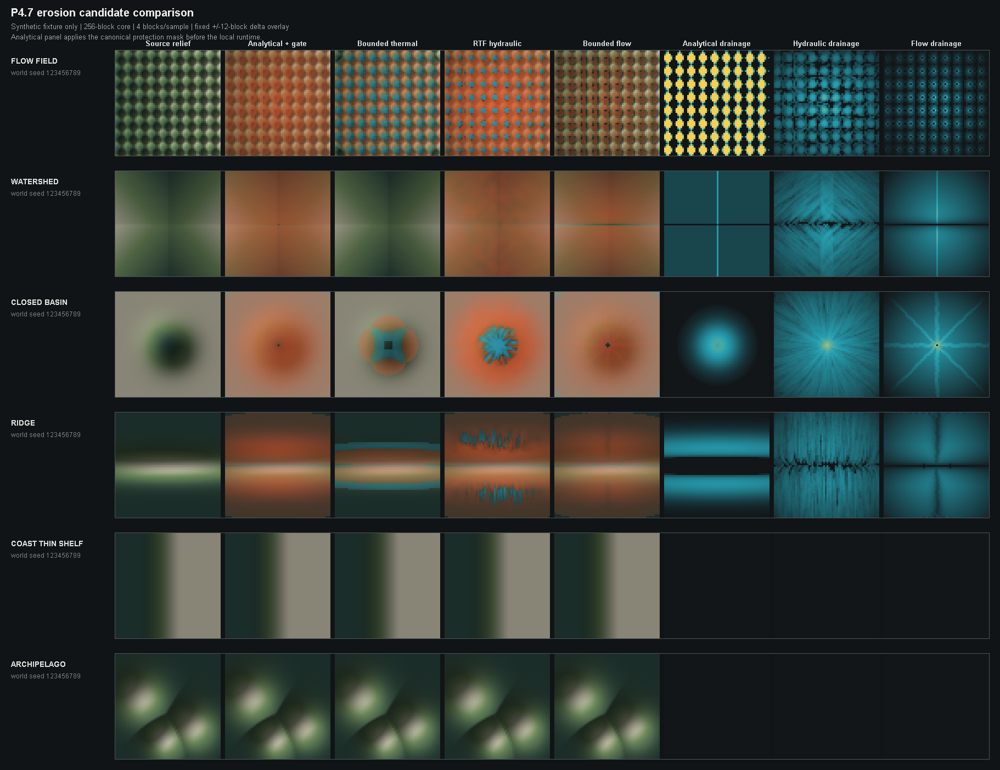

# P4.7 Candidate Visual Review 2026-07-26

> 文档状态：当前有效的 synthetic visual gate；不代表 Minecraft 实机外观、JFR 或正式算法选型完成。
> 固定 seed：`123456789`。
> 图像 SHA-256：`CE8A88951913892A1A1A90F7E76CFB96B1353329091CEFC1F50D4907A07BF52A`。

## 1. 对照口径

- 所有候选使用同一个 world-space `ErosionWorldFixtureBuilder` 和同一组 source channels。
- core 固定为 256 blocks，sample distance 固定为 4 blocks，halo 固定为 16 samples。
- 行固定覆盖 `FLOW_FIELD`、`WATERSHED`、`CLOSED_BASIN`、`RIDGE`、`COAST_THIN_SHELF`
  和 `ARCHIPELAGO`。
- relief panel 使用同一 source height range；橙色表示切削，青色表示沉积，delta 色标固定为
  `[-12, 12] blocks`。drainage panel 使用同一 `[0, 1]` 色标。
- analytical API 没有 canonical protection-mask 参数，因此 harness 在调用 local runtime 前应用
  `erosionProtected/AREA` gate；该包装只属于候选台，不是 production integration。

## 2. 审查中发现的契约问题

首次图像显示 analytical 在 `archipelagoDominant` 时保持 top/delta 不变，但仍发布非零
`drainagePotential`。这违反“零影响包含全部公开诊断通道”的约束。

根因已在 `EndAnalyticalErosionRuntime` 修复：activation 为零时，top 以外的 delta、strength、drainage
和 activation 全部严格归零；`EndAnalyticalErosionRuntimeTest.assertZeroImpact` 现显式检查 drainage。
修复后 coast 和 archipelago 行的所有候选 delta/drainage 均为零。

## 3. 候选观察

| Candidate | Synthetic visual result | 当前定位 |
| --- | --- | --- |
| Local analytical | flank 上产生大范围连续切削；`FLOW_FIELD` drainage 接近逐格曲率响应，没有稳定的方向网络 | 不通过独立成形视觉门禁；保留为低成本 baseline/fallback |
| Bounded thermal | 能守恒地松弛 spike/basin，并保护 ridge crest；4 邻域在规则输入上形成明显十字和网格取向 | 不作为独立侵蚀；只保留低强度、有界 smoothing 候选 |
| RTF-derived hydraulic | detail 最强，同时出现切削和沉积；规则场出现周期性沉积岛，basin/ridge 出现高频放射或条纹 | 保留为实机 finalist；必须检查真实 terrain 是否仍显得噪声化或过度沉积 |
| Bounded flow | 排水方向最清晰、ridge crest 保留最好、只做有限 dry incision；basin 出现 D8 八射线，watershed 有轴向直线 | 保留为实机 finalist/引导信号；不能单独冒充自然河网或 P5 authority |

## 4. 阶段结论

本轮只淘汰“analytical 单独承担最终外观”和“thermal 单独承担侵蚀”的路径，不选择正式冠军。
hydraulic 与 bounded flow 都进入下一门禁，但它们暴露的风险不同：前者是高频切削/沉积噪声，后者是
D8/固定步数方向性和过于规则的 dry channels。

不能根据 synthetic fixture 决定是否组合两者。组合会叠加 build peak、resident heap 和 C2ME duplicate
build 风险，必须先完成 P4.7-0B 的现有 runtime 四组合 JFR 基线，再用非持久化 dev-only hook 在真实
`REGION_PLANNED` terrain 上分别比较 finalist。该 hook 不得进入普通 v3/v4 builder、preset 或 UI。

## 5. 下一硬门禁

1. 按 ETF、ETF + C2ME、ETF + RTF、ETF + RTF + C2ME 完成 P4.7-0B 客户端/JFR baseline。
2. 分开记录 integrated-server worldgen、client mesh/render、GC、allocation、C2ME delegate 和首次传送峰值。
3. baseline 闭环后，为 hydraulic-only 与 bounded-flow-only 建立非持久化实机对照；组合方案只有在单候选
   无法同时达到视觉和性能门禁时才进入测量。
4. 在真实 terrain、finite volume、border、访问顺序、C2ME 和 JFR 同时通过前，不接入 `EndDensity`。
